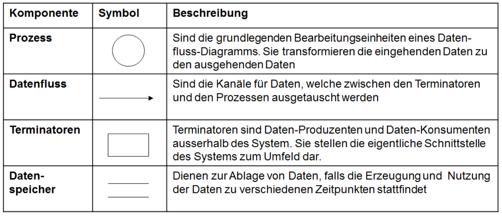
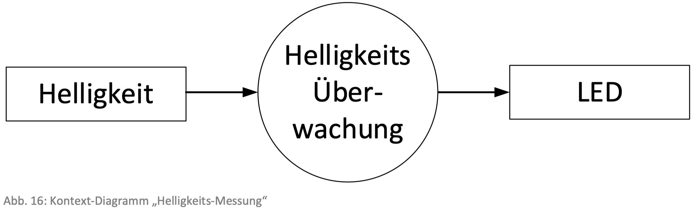
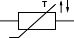
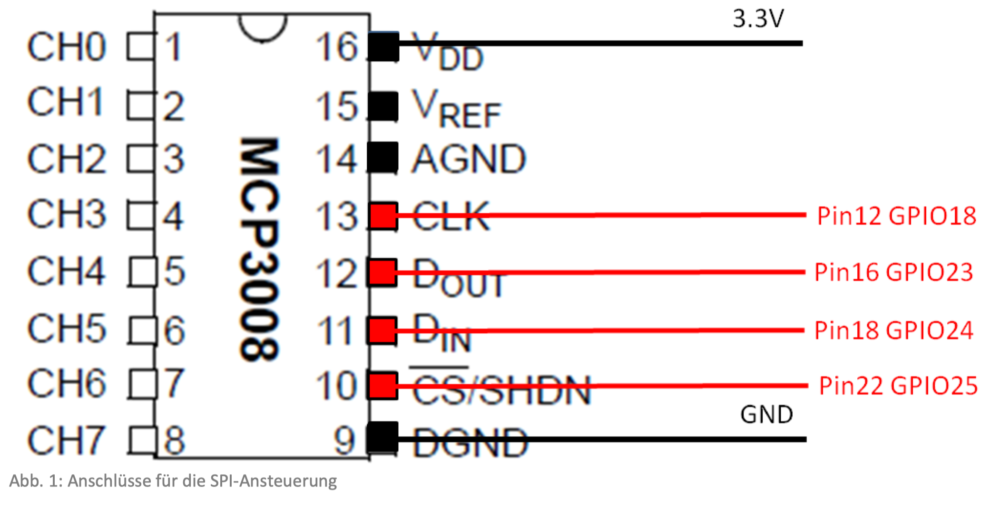
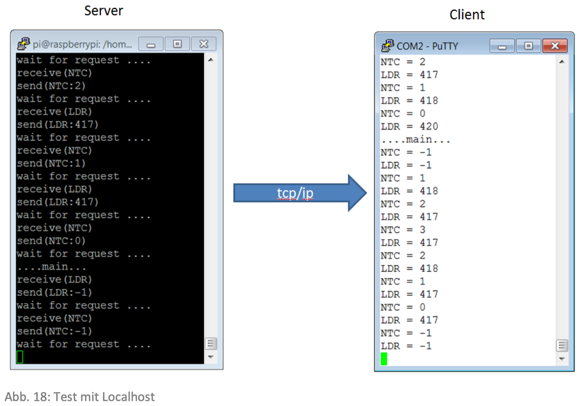

# ES&HH - Embedded Systems und Hardware Hacking

Inhaltsverzeichnus: https://ecotrust-canada.github.io/markdown-toc/

## Einleitung

Der Schwerpunkt des Moduls "Embedded Systems und Hardware Hacking" liegt in der Verbindung von Hard- und Software. Es wird deutlich, dass programmierbare Systeme immer aus Hard- und Software bestehen. Weiter wird gezeigt, wie Programme die einzelnen Hardwarekomponenten nutzen können, und welchen Einfluss dabei das Betriebssystem hat.

Als Vorbereitung erarbeiten Sie die Grundlagen, welche im Unterricht anhand eines Demo-Projekt vertieft werden. Dieses wird schrittweise weiter entwickelt und stellt die wesentlichen Elemente des Computers und vor allem seine Schnittstellen vor. Parallel dazu bearbeiten Sie in Gruppen eine Projektarbeit, welche die Themen der Messdatenerfassung, -verarbeitung und -visualisierung vertieft.

---

## Raspi connection

...@pi

**home**

```
ssh pi@192.168.2.96
```

**wired**

Pi

```
ssh pi@192.168.25.3
```

Mac

USB-Network manuell auf 192.168.25.4 gesetzt.

### Samba connetion:

**HomeWifi**:

```
smb://192.168.2.96
```

**wired**

```
smb://192.168.25.3
```

> pi:smbpi

### Autostart einrichten:

https://www.itechfy.com/tech/auto-run-python-program-on-raspberry-pi-startup/

#### **METHOD 1: rc.local**

On your Raspberry Pi terminal write the following command or you can also use your favourite editor to edit the file /etc/rc.local. Also, edit the permissions. This is useful if we want to plug our Raspberry Pi into power headless and have it run a program without configuration or a manual start.

Open rc.local file as super user-

```sh
sudo nano /etc/rc.local
```

After this, you will enter the nano file editor and here we have to add a command to execute our python program. Add the complete file execution line before *‘exit 0’* line at the end. After the editing saves the file and exit. For exit in nano type Ctrl x and for saving the file type Y.

Use ‘&’ at the end of the line if your program contains an infinite loop.

```sh
sudo python /home/pi/PiCube/Pattern1.py &
```


We add “&” at the end of the command as we need to end the command if the programs run continuously in an infinite loop we want to exit it. The ampersand will push the program to run on a separate process.

Now check whether the program will execute at the boot-up or not. Reboot your Raspberry Pi by adding this command: 

```sh
sudo reboot
```

##### **How to kill Program**

This python program will now execute on every boot-up and start-ups. Many times you will not be in need to run this program so to stop it we have “kill” the program. To kill down the process we have to do :

```sh
ps aux | grep /home/pi/PiCube/Pattern1.py
```

This command will give you all the details about the process like its process ID, location etc. the command will a line starts with root followed by the process ID of the file. We need this PID to kill the program. This command will be needed to kill the process: 

```sh
sudo kill PID
```


Note: rc.local also have drawbacks on Buster, Jessie and Stretch. Not all services are available on rc.local therefore not all the programs run properly.

#### **Method 2: Crontab**

Cron is an easy and important method for auto-run a script. The major advantage of Crontab is you can schedule tasks at any specific date or time and it will run the program without any delay. Many real-world applications uses Crontab for automation purpose. 

To make the program autorun we have first edit the cron file. Every Raspberry Pi have its Crontab and to edit it we have to add “sudo” and “crontab -e”.

```sh
sudo crontab -e
```

A nano file will be open, scroll down and add the command to the end of the file. 

```sh
@reboot python /home/pi/PiCube/Pattern1.py
```

This command tells the Pi that on every reboot it has to execute the program which is there in the location given in the command. And the “&” again at the end of the command means that the command will run in the background and it won’t stop the system booting up as before.


Save the nano file and exit it by the Ctrl x and Y. Reboot the Raspberry Pi by:

```sh
sudo reboot
```

To stop the program again you have to the PID of the process and kill the process. When you don’t want to execute the program anymore just remove the command “@reboot python /home/pi/PiCube/Pattern1/py” and the program will no longer run on boot ups.

#### **Method 4: Systemd**

The latest Raspbian have some of its boot sequences will lead some problems in running your python script using Cron or rc.local. “Systemd” is recommended to overcome such issues. 

Create a configuration file and edit it. This file will tell systemd which program needs to be executed :

```sh
sudo nano /lib/systemd/system/myscript.service
```

 Add the following lines in the file:

```
[Unit]

Description=PiCube Pattern

After=multi-user.target

[Service]

Type=idle

ExecStart=/usr/bin/python3 /home/pi/PiCube/Pattern1.py

[Install]

WantedBy=multi-user.target
```

Save and exit the nano file using Ctrl+x,Y and ENTER.

Change the permissions on the configuration file to 644:

```sh
sudo chmod 644 /lib/systemd/system/myscript.service
```

Now all the tell the systemd to start the process on boot up :

```sh
sudo systemctl daemon-reload
```

```sh
sudo systemctl enable myscript.service
```

Now reboot your Pi and the process should run:

```sh
sudo reboot
```

## Software des Moduls:

#### Install Java

Anschliessend installieren wir das Java Development Kit.

```
sudo apt-get install openjdk-8-jdk
```

gefolgt von der Laufzeitumgebung

```
sudo apt-get install openjdk-8-jre
```

Wobei es gut sein kann, dass bereits die neuste Version geladen ist.

#### Install Library Pi4J

http://pi4j.com/

```
curl –s get.pi4j.com | sudo bash
```

Dieser Befehl installiert die Pi4J-Libraries in die drei Directories:

```
      /opt/pi4j/bin
      /opt/pi4j/examples
      /opt/pi4j/lib
```

Mehr Informationen finden Sie unter:

#### Install RPi.GPIO

```
sudo apt-get install rpi.gpio
```

#### Install WiringPi

http://wiringpi.com/download-and-install/

```
sudo apt-get install wiringpi
```

## Raspberry Pi - Pin Belegungsplan


## 1 Einführung, Überblick und Inbetriebnahme

### LERNZIELE

- Ich kenne den Aufbau des Raspberry Pi (Klein-Computer).
- Ich bin in der Lage, den Raspberry Pi zu starten und unter Linux in Betrieb zu nehmen.
- Ich habe einen Überblick der Möglichkeiten des Raspberry Pi insbesondere auch der Betriebssysteme und Programmiersprachen, welche für dieses System verfügbar sind.
- Ich kenne die verschiedenen Prozessorarchitekturen.
- Ich habe ein lauffähiges System und bin in der Lage, die Übungen durchzuführen („durchzuspielen“).
- Ich habe einen groben Überblick verschiedener Projekte, welche mit dem Raspberry Pi bereits gelöst wurden, bzw. an welchen gearbeitet wird.
- Ich kenne die wichtigsten Tutorials, Foren, Blogs ..., welche den Raspberry Pi betreffen.

### VORBEREITUNG (4h)

[Tutorial - Raspberry Pi3 Einrichtung](https://youtu.be/pxyQMO2DC0g)

- Schnellstart 
  
  - Auspacken (*Link auf das aktuelle Starter-Kit, sobald die Kits verteilt wurden*)
  - [SD-Karte erstellen](https://www.raspberrypi.org/documentation/installation/installing-images/)
    - [Pi Imager](https://www.youtube.com/watch?v=ntaXWS8Lk34)
  - [Anschliessen (Bildschirm und Tastatur) und Einschalten](https://projects.raspberrypi.org/en/projects/raspberry-pi-setting-up/4)
  - [Konfigurieren](https://www.elektronik-kompendium.de/sites/raspberry-pi/1906291.htm)

- Erarbeiten Sie sich rudimentäre Linux-Kenntnisse ([Kommandos](http://www.elektronik-kompendium.de/sites/raspberry-pi/2107041.htm))
  
  - [Raspberry Pi: SSH-Verbindung aufbauen](https://www.elektronik-kompendium.de/sites/raspberry-pi/2206121.htm)
  
  - [Raspberry Pi: IP-Adresse ermitteln](https://www.elektronik-kompendium.de/sites/raspberry-pi/1906271.htm)

- [Vorbereitung auf die erste PräsenzDatei](https://moodle.ffhs.ch/mod/resource/view.php?id=3844381) 514.4KB


- [Installation für die erste PräsenzDatei](https://moodle.ffhs.ch/mod/resource/view.php?id=3844382) 189.9KB

- [Schnellstart ohne Bildschirm und TastaturDatei](https://moodle.ffhs.ch/mod/resource/view.php?id=3844383) 1.2MB

- [Installation (weitere Informationen)Textseite](https://moodle.ffhs.ch/mod/page/view.php?id=3844384)

- [Inbetriebnahme und SchnellstartTest](https://moodle.ffhs.ch/mod/quiz/view.php?id=3844385)

#### Quiz

- [Quiz zum Thema LinuxTest](https://moodle.ffhs.ch/mod/quiz/view.php?id=3844386)

##### Frage 1

Wie können Sie unter Linux den Inhalt eines Verzeichnisses (Directory) anzeigen?

```
ls
```

##### Frage 2

Mit welchem Befehl können Sie anzeigen, in welchem Directory Sie sich befinden?

```
pwd
```

##### Frage 3

Wie können Sie Inhalt des Command-Windows löschen?

```
clear
```

##### Frage 4

Welcher der folgenden Befehle gefolgt von einem Directorynamen verwenden Sie, um in dieses Directory zu wechseln?

```
cd
```

##### Frage 5

Wie können Sie ein neues Verzeichnis erstellen?

```
mkdir
```

##### Frage 6

Wie können Sie ein File (xyz.c) aus dem aktuellen Verzeichnis ins Verzeichnis /tmp kopieren?

```
cp xyz.c /tmp
```

##### Frage **7**

In welchem Verzeichnis finden Sie die wichtigsten Konfigurationen?

```
/etc
```

##### Frage **8**

In welchem Verzeichnis sind die Gerätetreiber abgelegt, welche den Zugriff auf bestimmte Hardware-Komponenten erlauben?

```
/dev
```

#### Raspi commands

```
sudo raspi-config
```

##### Updaten

```
sudo apt-get update
sudo apt-get upgrade
```

##### Herunterfahren

```
sudo shutdown -h 0
sudo reboot
```

#### Install Java

Anschliessend installieren wir das Java Development Kit.

```
      $ sudo apt-get install openjdk-8-jdk
```

gefolgt von der Laufzeitumgebung

```
      $ sudo apt-get install openjdk-8-jre
```

Wobei es gut sein kann, dass bereits die neuste Version geladen ist.

#### Install Library Pi4J

http://pi4j.com/

```
curl –s get.pi4j.com | sudo bash
```

Dieser Befehl installiert die Pi4J-Libraries in die drei Directories:

```
      /opt/pi4j/bin
      /opt/pi4j/examples
      /opt/pi4j/lib
```

Mehr Informationen finden Sie unter:

#### Install RPi.GPIO

```
sudo apt-get install rpi.gpio
```

#### Install WiringPi

http://wiringpi.com/download-and-install/

```
sudo apt-get install wiringpi
```

### PRÄSENZ

- Übersicht der verbreitetsten Einplatinen-Computer
- Hardware-Aufbau des Raspberry Pi
  - Block-Schaltbild
  - Prozessor
  - Schnittstellen
- Einführung Elektrotechnik und Elektronik
  - Lesen von elektrischen Schemata
  - Hilfe zur Selbsthilfe (Links, Tutorials, …)
- Betriebssystem
  - Übersicht und Quellen
  - Typische Verwendungen (Vor- und Nachteile)
- Programmiersprachen
  - Übersicht und typische Verwendung
  - Beispiele zu (Python, Java, C und Scratch)

#### Raspberry Pi 3 B+


#### Raspberry Pi - Pin Belegungsplan


#### LED Datenblatt


#### Berechnung des Vorwiderstandes


#### Schaltbilder für LED Ansteuerung

##### Dauerstrom mit Taster


##### Blinker mit Python


```python
#!/usr/bin/env python3 from RPi import GPIO import time

GPIO.setmode(GPIO.BCM)
GPIO.setup(18, GPIO.OUT)

print("Start")

for i in range(1, 11):
    if((i % 2) == 0):
        GPIO.output(18, True) 
    print("OFF") 
  else:
        GPIO.output(18, False) 
    print("ON") time.sleep(1)

print("Ende")

GPIO.cleanup()
```

##### Tastersteuerung mit Python über GPIO.BCM


```python
#!/usr/bin/env python3 from RPi import GPIO import time

GPIO.setmode(GPIO.BCM)
GPIO.setup(18, GPIO.OUT)
GPIO.setup(23, GPIO.IN)

print("Start")

while True:
    if(GPIO.input(23) == 0):
        GPIO.output(18, True) 
    print("OFF") 
  else:
        GPIO.output(18, False) 
    print("ON") time.sleep(2)

print("Ende")

GPIO.cleanup()
```

### NACHBEREITUNG

- Hardwareaufbau analysieren 
- [GPIOs schreiben und lesen mit Python und Java (Vertiefung)Textseite](https://moodle.ffhs.ch/mod/page/view.php?id=3844392)

#### Raspberry Pi GPIO: 17 pins

- 7 general

- 1 pwm

- 2I2C

- 5SPI

- 2UART

> CMOS (3.3 volts) and not TTL (5 volts) take care!
> 
> MAX232 can convert 5-3 volts vice-versa

#### Ports

Digital: 0 or 1 represented by Ovolts or 3.3volts

Analog: value is voltage analog. Ex. OV means 0, 3.3volts mean 1023

PWM: modularization of digital port. Used to control power, speed, etc.

With 2 or more digital ports you can create a communication protocol

#### Famous Communication Protocol

- UART: classic serial communication
- SPI Serial Peripheral Interface Bus
- I2C: low speed interface bus to communicate with components


- Bearbeiten der Übungen:
  
  - Linux auf dem Raspberry Pi
  - Programmieren mit Python

- Ideen für Projekte suchen, zusammentragen und auswählen

- [Projekt: Initialisierung (Produktideen)Aufgabe](https://moodle.ffhs.ch/mod/assign/view.php?id=3844395)

---

## 2 Prozesse und Prozessdaten

### LERNZIELE

- Ich kann den Raspberry Pi in ein Netzwerk integrieren.
- Ich kann Daten speichern und Daten vom bzw. zum Raspberry Pi transferieren.
- Ich kann den Raspberry Pi konfigurieren und SD-Cards mit verschiedenen Konfigurationen und Betriebssystemen erstellen.
- Ich kenne die Definition des technischen Prozesses sowie seiner Kenngrössen.
- Ich kann technische Prozesse beschreiben und diese in Teilprozesse zerlegen.
- Ich habe die wichtigsten Werkzeuge der Analyse und des Entwurfs von Embedded Systems angewendet.

### VORBEREITUNG

- Erstellen Sie eine [SD-Card ](https://www.raspberrypi.org/documentation/installation/installing-images/)mit einem [Betriebssystem ](http://www.elektronik-kompendium.de/sites/raspberry-pi/2002091.htm)(z.B. Raspbian) für den Raspberry Pi

- Binden Sie einen [USB-Stick oder eine Festplatte ](http://www.elektronik-kompendium.de/sites/raspberry-pi/2102191.htm)ein

- Integrieren Sie den Raspberry Pi ins lokale Netzwerk (Heimnetzwerk)

- - [LAN Anbindung ](https://www.elektronik-kompendium.de/sites/raspberry-pi/2008011.htm)
  - [WLAN Anbindung ](https://www.raspberrypi.org/documentation/configuration/wireless/README.md)(siehe auch [WLAN-Adapter einrichten](http://www.elektronik-kompendium.de/sites/raspberry-pi/1912221.htm))
  - Ins Heimnetzwerk mit einem [Sambaserver](https://www.elektronik-kompendium.de/sites/raspberry-pi/2007071.htm)
  - Einen Webserver ([Apache](https://www.raspberrypi.org/documentation/remote-access/web-server/apache.md)), PHP und mySQL installieren

#### Samba einrichten

[Elektronik-Kompendium](https://www.elektronik-kompendium.de/sites/raspberry-pi/2007071.htm)

Das Ziel ist, den Raspberry Pi als File-Server zu betreiben, auf den  man per Windows-Explorer zugreifen kann. Die dafür am besten geeignete  Software-Lösung ist ein Samba-Server. Mit Samba lassen sich fast alle  Funktionen eines Windows-Servers realisieren.

Dazu gehören:

- Datei- und Verzeichnis-Freigaben (Shares)
- Drucker-Freigaben
- Active Directory Domain Controller (ab Samba 4)

##### Samba-Server installieren

```sh
sudo apt-get update
sudo apt-get install samba samba-common smbclient
```

Prüfung ob Samba läuft:

```sh
sudo service smbd status
sudo service nmbd status
```

### Grundkonfiguration

zentrale Konfigurationsdatei "/etc/samba/smb.conf"

Eine Sicherheitskopie erstellen:

```sh
sudo mv /etc/samba/smb.conf /etc/samba/smb.conf_alt
```

Konfigdatei öffnen:

```sh
sudo nano /etc/samba/smb.conf
```

Inhalt ersetzen mit:

```
[global]
workgroup = WORKGROUP
security = user
encrypt passwords = yes
client min protocol = SMB2
client max protocol = SMB3
```

- Der Parameter "workgroup" gibt die Bezeichnung der Arbeitsgruppe an.
- Der Parameter "security" gibt an, welche Sicherheitsstufe beim Zugriff auf die Freigaben gelten sollen.
- Der Parameter "encrypt passwords" mit "yes" sorgt dafür, dass die  Passwörter bei der Authentifizierung verschlüsselt übertragen werden.
- kleinstes und höchstes SMB-Protokoll-Version angegeben

Testen der Konfigurationsdatei:

```sh
testparm
```

```
rlimit_max: increasing rlimit_max (1024) to minimum Windows limit (16384)
Load smb config files from /etc/samba/smb.conf
rlimit_max: increasing rlimit_max (1024) to minimum Windows limit (16384)
Loaded services file OK.
Server role: ROLE_STANDALONE

Press enter to see a dump of your service definitions

# Global parameters
[global]
    client max protocol = SMB3
    client min protocol = SMB2
    security = USER
    idmap config * : backend = tdb
```

Nach jeder Änderung an der Konfigurationsdatei müssen die Samba-Dienste neu gestartet werden:

```sh
sudo service smbd restart
sudo service nmbd restart
```

##### Samba-Freigaben für Verzeichnisse einrichten

Um Freigaben für Verzeichnisse einzurichten brauchen wir als erstes ein  Verzeichnis, in dem wir die Verzeichnisse anlegen, die wir später  freigeben wollen.

```sh
sudo mkdir /home/shares
```

Allgemeines Verzeichnis für alle zum Testen:

```sh
sudo mkdir /home/shares/test
sudo chown root:root /home/shares/test/
sudo chmod 777 /home/shares/test/
```

Verzeichnis nur für die Benutzergruppe "users":

```sh
sudo mkdir /home/shares/users
sudo chown root:users /home/shares/users/
sudo chmod 770 /home/shares/users/
```

Verzeichnis nur für den Benutzer "pi":

```sh
sudo mkdir /home/shares/pi
sudo chown pi:pi /home/shares/pi/
sudo chmod 700 /home/shares/pi/
```

##### Freigaben einrichten

Freigaben in Samba-Konfogurationsdatei hinterlegen:

```sh
sudo nano /etc/samba/smb.conf
```

Per angelegtes Verzeichnis zur Konfigurationsdatei hinzufügen:

- Der Name der Freigabe ist in eckige Klammern gesetzt.

```sh
[SambaTest]
comment = Samba-Test-Freigabe
path = /home/shares/test
read only = no
```

```sh
[SambaUsers]
comment = Samba-Users-Freigabe
path = /home/shares/users
read only = no
```

```sh
[SambaPi]
comment = Samba-Pi-Freigabe
path = /home/shares/pi
read only = no
```

Konfiguration testen:

```
rlimit_max: increasing rlimit_max (1024) to minimum Windows limit (16384)
Load smb config files from /etc/samba/smb.conf
rlimit_max: increasing rlimit_max (1024) to minimum Windows limit (16384)
Processing section "[SambaTest]"
Processing section "[SambaUsers]"
Processing section "[SambaPi]"
Loaded services file OK.
Server role: ROLE_STANDALONE

Press enter to see a dump of your service definitions

# Global parameters
[global]
    client max protocol = SMB3
    client min protocol = SMB2
    security = USER
    idmap config * : backend = tdb


[SambaTest]
    comment = Samba-Test-Freigabe
    path = /home/shares/test
    read only = No


[SambaUsers]
    comment = Samba-Users-Freigabe
    path = /home/shares/users
    read only = No


[SambaPi]
    comment = Samba-Pi-Freigabe
    path = /home/shares/pi
    read only = No
```

Wenn der Test erfolgreich war, dann muss Samba neu gestartet werden:

```sh
sudo service smbd restart
sudo service nmbd restart
```

##### Samba-Passwort für Benutzer einrichten

(Benutzerverwaltung)

Betriebssystem User anlegen:

```
useradd -s /bin/false -g users -m {USERNAME}
```

/bin/false wenn sich der Benutzer nicht am Betriebsystem anmelden soll.

Samba-Benutzer einrichten:

```sh
smbpasswd -a {USERNAME}
```

```sh
New SMB password: {PASSWORD}
Retype new SMB password: {PASSWORD}
```

Aktiviert den Benutzer in der Samba-Datenbank:

```sh
smbpasswd -e {USERNAME}
```

Deaktiviert den Benutzer in der Samba-Datenbank:

```sh
smbpasswd -d {USERNAME}
```

Entfernt den Benutzer aus der Samba-Datenbank:

```sh
smbpasswd -x {USERNAME}
```

Persönliche Konfiguration:

```sh
sudo smbpasswd -a pi
```

> smbpi

#### Apache Web Server einrichten

[Raspberry Doku](https://www.raspberrypi.org/documentation/computers/remote-access.html)

##### Installation

```sh
sudo apt install apache2 -y
```

##### Default Web Page

```sh
cd /var/www/html
ls -al
```

Owner wechseln:

```sh
sudo chown pi: index.html
```

##### Access Web Page

**HomeWifi**

http://192.168.2.96

**wired**

http://192.168.25.3

#### PHP installieren

```sh
sudo apt install php libapache2-mod-php -y
```

```sh
sudo rm index.html
```

```sh
sudo nano index.php
```

```php
<?php echo date('Y-m-d H:i:s'); ?>
```

```php
<?php phpinfo(); ?>
```

##### Access Web Page

**HomeWifi**

http://192.168.2.96

**wired**

http://192.168.25.3

#### MySQL installieren

[Mariadb](https://tutorials-raspberrypi.de/webserver-installation-teil-3-mysql/)

```sh
sudo apt-get -y install mariadb-server-10.0 php7.3-mysql mariadb-client-10.0
```

```sh
sudo mysql
```

### PRÄSENZ

#### 1 Organisation

##### 1.1 Ziele

Nach dieser Lektion sind Sie in der Lage:

- Die wichtigsten Eigenschaften von Realtime-Systemen aufzuzählen
- Ein Embedded-Software-Projekt zu planen
- Die Analyse und das Design für ein Embedded-System durchzuführen

##### 1.2 Ablauf

- Einführung und Überblick 
  - Ziele, Aufbau und Ablauf der zweiten Präsenz
- Fragen und Repetition
- Lernkontrolle
- Begriffe
- Software-Engineering 
  - Was ist gleich? 
  - Was ist anders?
- Methoden SADT vs. OO
- Prozessdatenverarbeitung
- Demo-Projekt
- Vertiefungsprojekt 
  - Projekt-Skizze 
  - Ziele bzw. Anforderungen definieren
- Zusammenfassung und Ausblick

#### 2 Begriffe

In der technischen Informatik spielen die Begriffe aus der Mess-, Steuer- und Regeltechnik eine zentrale Rolle. Im Folgenden eine kurze recht oberflächliche Definition der Begriffe:

| Begriff | Erklärung                                                                                                                                                                                                                                                                                                                                                                                                                                                                                                                                                                                                                                                                                                                                                                                                                                                      |
| ------- | -------------------------------------------------------------------------------------------------------------------------------------------------------------------------------------------------------------------------------------------------------------------------------------------------------------------------------------------------------------------------------------------------------------------------------------------------------------------------------------------------------------------------------------------------------------------------------------------------------------------------------------------------------------------------------------------------------------------------------------------------------------------------------------------------------------------------------------------------------------- |
| Messen  | Ziel einer Messung ist es, ein Messergebnis als verlässliche Aussage zu erhalten über eine unbekannte Grösse eines Objekts. „Die Tätigkeiten des Messens sind überwiegend praktischer (experimenteller) Art, schliessen jedoch theoretische Überlegungen und Berechnungen ein.“1                                                                                                                                                                                                                                                                                                                                                                                                                                                                                                                                                                               |
| Steuern | Die Steuerung von physikalischen Grössen ist ein Verfahren, bei dem die zu beeinflussende Grösse - wie Temperatur, Druck, Füllmenge, Drehzahl, etc. - mit Hilfe einer Stellgrösse verändert und auf einen bestimmten Wert eingestellt wird. Aufgrund von äusseren Einflüssen - bei einer Temperatursteuerung z.B. Sonneneinfluss - treten Abweichungen zwischen dem Sollwert und dem Istwert der zu beeinflussenden Grösse auf. Charakteristisch für die Steuerung ist nun, dass sie auf solche Veränderungen nicht reagiert.Für eine Steuerung sind folgende Kriterien charakteristisch:• Keine Rückkopplung der zu beeinflussenden Grösse (Istwertes)• Keine automatische Kompensation von Störungen und von Ungenauigkeiten von Steuergeräten und der Steuerstrecke• Abweichungen werden manuell vorgenommen durch Nachführen der Führungsgrösse (Sollwert) |
|         |                                                                                                                                                                                                                                                                                                                                                                                                                                                                                                                                                                                                                                                                                                                                                                                                             |
| Regeln  | Die Regelung von physikalischen Grössen ist ein Verfahren, bei dem die zu beeinflussende Grösse: Regelgrösse x (Istwert) laufend erfasst und mit der Führungsgrösse w (Sollwert) verglichen wird. Treten Abweichungen auf, wird die Stellgrösse y so verändert, dass die Abweichung minimal wird oder ganz verschwindet.Die Kennzeichnung einer Regelung ist deshalb die geschlossene Wirkungskette:• Ständige Rückmeldung über den Zustand der zu regelnden Strecke (Regelstrecke), dadurch können aber Stabilitätsprobleme auftreten, welche bei der reinen Steuerung kein Problem sind.• Automatisches Nachführen von Regelabweichungen• Störeinflüsse werden erkannt und indirekt kompensiert                                                                                                                                                              |
|         |                                                                                                                                                                                                                                                                                                                                                                                                                                                                                                                                                                                                                                                                                                                                                                                                             |

#### 3 Software-Engineering (Repetition)

Im Fach Software-Engineering wurden mehrere Vorgehens- und Prozessmodelle vorgestellt. Die Mutter aller Vorgehensmodelle ist das Wasserfallmodell


Dabei geht es vereinfacht um folgende Punkte:

- Analyse = das Problem verstehen
- Entwurf = die Lösung verstehen
- Realisierung = die Lösung bauen
- Test und Wartung = die Lösung prüfen und einsetzten

In unserem Projekt werden wir auch nach diesem Muster vorgehen, wobei dieses Modell nicht nur auf das gesamte Projekt, sondern auch auf die Teilprojekte angewendet wird (Inkrementelles Vorgehen).

Im Buch zum Fach Software-Engineering (Ludewig, 2013) wurden im Kapitel Entwurf folgende Entwicklungsrichtungen vorgestellt:


Der Top-down-Entwicklung wird die Bottom-up-Entwicklung gegenübergestellt, welche gewählt wird, wenn auf einer exotischen Hardware implementiert werden soll. Bei diesem Ansatz synthetisiert der Entwickler die Befehle solange, bis die Gesamtlösung entstanden ist. Obwohl der Raspberry Pi nicht als exotische Hardware betrachtet werden kann, müssen wir aufgrund unserer geringen Erfahrung, wohl mehrheitlich bottom-up vorgehen. Wir werden in der Regel Prototypen der Teilprojekte erstellen (z.B. lesen von XYZ-Sensoren, ansteuern von XYZ-Aktoren, ..) und diese anschliessend in einem top-down erstellten Rahmen unterbringen.

##### 3.1 Werkzeuge

Als Hilfsmittel beim Entwerfen steht uns OOA und OOD mit UML und/oder SA und SD mit Kontext und Datenflussdiagrammen zur Verfügung.

Wenn Sie mit UML arbeiten, werden Sie vor allem Klassendiagramme zur Darstellung der statischen Struktur des Systems, sowie Aktivitäts- und Zustandsdiagramme, um das Verhalten der einzelnen Komponenten zu beschreiben, verwenden. Die Interaktion der Komponenten kann mittels Sequenzdiagrammen beschrieben werden. Diesen Teil kennen Sie aus dem Fach Software-Engineering und haben Sie während dem bisherigen Studium dauernd angewendet.

Bei der strukturierten Analyse und dem strukturierten Entwurf werden Sie das System zuerst mittels KontextDiagramm abbilden, und anschliessend mittels Datenflussdiagrammen systematisch in Teilsysteme unterteilen.



###### 3.1.1 Kontextdiagramm

Anhand des Beispiels der Armaturen-Elektronik eines Fahrzeugs behandeln wir das Kontextdiagramm:


https://www.edrawsoft.com/de/data-flow-diagram-symbols.html

###### 3.1.2 Datenflussdiagramm

Der nächste Schritt ist die Aufteilung, bzw. Gliederung der Aufgabe in Teilaufgaben:


Jetzt können die Teilprozesse 1..9 jeweils weiter unterteilt werden in die Teilprozess 1.1 - 1.n bis 9.1 - 9.n dies ergibt dann neun Datenflussdiagramme Level 1.

#### 4 Prozessdatenverarbeitung

Die Prozessdatenverarbeitung unterscheidet sich (Jacobson, 1989) vor allem dadurch, dass der Rechner nicht in erster Linie zur Verarbeitung von Daten, sondern vorwiegend zur Überwachung und Lenkung eines (technischen) Prozesses verwendet wird.


##### 4.1 Der Prozess

Das Wort „Prozess“ ist abgeleitet vom lateinischen Wort „procedere“ = „voranschreiten“. Damit ist klar, dass es sich bei einem Prozess um etwas Dynamisches handelt. Ein Prozess oder genauer ein technischer Prozess nach DIN 66201 ist wie folgt definiert:

„Ein Prozess ist eine Gesamtheit von aufeinander einwirkenden Vorgängen in einem System, durch die Materie,

Energie oder Information umgeformt, transportiert oder gespeichert wird. Ein technischer Prozess ist ein Prozess,

dessen physikalische Grössen mit technischen Mitteln erfasst und beeinflusst werden.“

Prozesse können also nach der Verarbeitungsart und nach dem Verarbeitungsgut unterschieden werden. Sie können weiter in Elementarprozesse zerlegt werden, welche genau eine Verarbeitungsart auf ein Verarbeitungsgut anwenden.


Ein Elementarprozess wird also durch eine der drei Verarbeitungsarten und eines der Verarbeitungsgüter bestimmt. So ergeben sich neun verschiedene Grundtypen.

##### 4.2 Prozessdaten und Prozessgrössen

Die Begriffe Prozessdaten und Prozessgrössen müssen inhaltlich deutlich unterschieden werden (Jacobson, 1989):

- Prozessdaten werden zwischen Prozess und Prozessrechner ausgetauscht, und sind dem Rechner zugeordnet
- Prozessgrössen beschreiben einen technischen Prozess unabhängig von seiner Lenkung durch einen Rechner


Sehr interessant ist die Gliederung in

- Prozesskennwerte (Konstanten die sich nie verändern)
- Prozessparameter (Konstanten die zu Beginn des Prozesses definiert werden, und sich während des Prozesses nicht verändern)
- Prozesszustand (Variable, die den momentanen Zustand des Prozesses repräsentiert)

Aus Sicht des Rechners sieht es einfacher aus:


##### 4.3 Beispiel

Definieren Sie die Prozessgrössen des folgenden Parkhauses:


| Prozess Grösse   | Beispiele aus Garage                                                                                                              |
| ---------------- | --------------------------------------------------------------------------------------------------------------------------------- |
| Verarbeitungsgut | Fahrzeuge                                                                                                                         |
| Verarbeitungsart | Speichern                                                                                                                         |
| Prozesskennwerte | Anzahl Etagen, Weglänge der Ein- und Ausfahrt, max. Fahrzeugbreiten, max. Fahrzeughöhen                                           |
| Prozessparameter | Anzahl der Stellplätze, max. zulässige Geschwindigkeiten, Grösse und Darstellungsart der Anzeige                                  |
| Prozesszustand   | Zahl der vorhanden Fahrzeuge →belegte Plätze Kann nur indirekt bestimmt werden, über die Zahl der ein- und ausfahrenden Fahrzeuge |
| Eingangsgrössen  | Einfahrende Fahrzeuge, Zustand der Schranken, evtl. Zustand der Anzeige                                                           |
| Ausgangsgrössen  | Ausfahrende Fahrzeuge, Informationen für Anzeige (frei, belegt, ….)                                                               |

#### 5 Demo-Projekt

Anhand des Demo-Projekts vertiefen wir die verschiedenen Analyse- und Entwurfs-Methoden.

##### 5.1 Projekt-Idee

**Motivation**

Energie ist ein rares und wertvolles Gut und sollte nicht verschwendet werden. Unnötig brennende Lichter, Fenster, welche zu schliessen vergessen wurden, das muss heute nicht mehr sein.

**Aufgabe**

Die Räume eines Gebäudes sollen überwacht und kontrolliert werden. Jeder Raum soll über eine eigene lokale Überwachung verfügen, diese sollen aber die Daten an eine Zentrale weitergeben. Die Räume sind unterschiedlich gebaut und gestaltet und können in einem Bürogebäude, Schulhaus usw. sein, also z.B. ein Schulzimmer (der Einfachheit halber nehmen wir unseren Unterrichtsraum).

Wir möchten die Temperatur und die Helligkeit in diesem Raum messen und aufzeichnen. Zusätzlich soll registriert werden, welche Fenster geöffnet sind, ob die Storen oben oder unten sind. Die Lichter sollen durch unsere Steuerung ein- und ausgeschaltet werden können.

Eine viertel Stunde nach dem der Raum abgeschlossen wurde, sollen die Lichter automatisch löschen. Falls der Raum geschlossen wird und noch Fester offen, oder Lichter an sind, soll dies durch eine Kontrolllampe beim Schloss signalisiert werden.

Von einer Zentrale aus kann der Zustand jedes Raumes überwacht werden.

**Optimierungen**

Falls die Raumtemperatur einen gewissen Wert übersteigt und es Tag ist sollen automatisch die Storen heruntergelassen werden

Wenn es im Raum genügend hell ist, sollen die Lichter ausgeschaltet werden.

Wenn die Türe geschlossen und noch Personen im Raum sind, soll dies ebenfalls durch die Kontrolllampe beim Schloss signalisiert werden.

**Vorgehen**

- Erstellen Sie ein Kontext-Diagramm.
- Teilen Sie das System mittels Klassen- und Sequenzdiagrammen oder Datenflussdiagrammen in sinnvolle Teilsysteme bzw. Teilprozesse auf.
- Überlegen Sie sich, wie Sie die Eingangsgrössen Messen, bzw. die Ausgangsgrössen steuern können.
- Erstellen Sie ein Prototyp, welcher eine Hell- Dunkel-Überwachung testet.
- Für die zentrale Überwachung ist ein einfaches Web-Interface vorgesehenen, erstelle Sie ein rudimentärer Prototyp, um sicherzustellen, dass dies funktioniert.

#### 6 Projektarbeit

##### 6.1 Aufgabenstellung

Im Modul Embedded-Systems und Hardware Hacking können Sie Ihre Kenntnisse aus den Modulen OOP, PVAJ bzw. PVA&NV und SWE anwenden und vertiefen. Sie bearbeiten ein Hard- Softwareprojekt von A-Z, das heisst, vom Bestimmen der Anforderungen, bis hin zur Inbetriebnahme und Übergabe an den Kunden.

Am Ende des Moduls haben Sie einen lauffähigen Prototyp des Gerätes, welchen Sie in einer Gruppe entwickelt haben. Dabei haben Sie folgende Tätigkeiten bearbeitet:

- Definieren der Aufgabenstellung und Erstellen eines detaillierten Terminplanes
- Evtl. definieren und beschreiben der Use-Cases
- Bestimmen der Anforderungen (Anforderungs-Katalog)
- Entwerfen von Lösungsvorschlägen (mind. drei Grob-Entwürfe)
- Ausarbeiten eines Detailentwurfs (statische und dynamische Modelle)
- Implementieren und testen der Applikation
- Erstellen von Test- und Abnahme-Berichten bzw. Protokollen
- Terminkontrolle

Hier einige Projektideen:

- Bewässerungsanlage für Garten oder Balkon
- Wecker mit grosser LED-Anzeige
- Model-Fahrzeug (z.B. Lego), welches einem Pfad folgt
- Steuerung einer Modeleisenbahnanlage 

Suchen Sie auch im Web nach Ideen.

**Meilensteine**:

| Wann?                                          | Was?                                                                                                                                                                                                     |
| ---------------------------------------------- | -------------------------------------------------------------------------------------------------------------------------------------------------------------------------------------------------------- |
| 1 Woche vor der zweiten Präsenz Zweite Präsenz | Abgabe: Projektidee (Skizze) Feedback: Projektidee (Skizze)                                                                                                                                              |
| 1 Woche vor der dritten Präsenz Dritte Präsenz | Abgabe: Kontextdiagramm, Anforderungsliste, Terminplan Feedback: Analyse                                                                                                                                 |
| 1 Woche vor der vierten Präsenz                | Abgabe: Schaltungsentwurf (Skizze, evtl. Versuchsschaltungen)<br />Softwareentwurf (Prozesse, Module, Abläufe, Prozessbeschreibungen, ..)<br />Testkonzept (Testfälle / Testszenarien, Testumgebung, ….) |
| Vierte Präsenz                                 | Feedback: Entwurf                                                                                                                                                                                        |
| 1 Woche vor der letzten Präsenz                | Abgabe: Projektdokumentation                                                                                                                                                                             |
| Letzte Präsenz                                 | Präsentation der Resultate <br />Feedback: Zur Projektarbeit (Dokumentation und Präsentation)                                                                                                            |

Abgabe: Projektidee (Skizze) Feedback: Projektidee (Skizze)

Abgabe: Kontextdiagramm, Anforderungsliste, Terminplan Feedback: Analyse

Abgabe: Schaltungsentwurf (Skizze, evtl. Versuchsschaltungen) Softwareentwurf (Prozesse, Module, Abläufe, Prozessbeschreibungen, ..)

Testkonzept (Testfälle / Testszenarien, Testumgebung, ….) Feedback: Entwurf

Abgabe: Projektdokumentation

Präsentation der Resultate Feedback: Zur Projektarbeit (Dokumentation und Präsentation)

#### 7 Anhang

##### 7.1 Lösung Parkhaus

| Verarbeitungsgut | Fahrzeuge                                                                                        |
| ---------------- | ------------------------------------------------------------------------------------------------ |
| Verarbeitungsart | Speichern                                                                                        |
| Prozesskennwerte | Anzahl Etagen, Weglänge der Ein- und Ausfahrt, max. Fahrzeugbreiten, max. Fahrzeughöhen          |
| Prozessparameter | Anzahl der Stellplätze, max. zulässige Geschwindigkeiten, Grösse und Darstellungsart der Anzeige |
| Prozesszustand   | Zahl der vorhandenen Fahrzeuge → belegte Plätze                                                  |
| Eingangsgrössen  | Einfahrende Fahrzeuge, Zustand der Schranken, evtl. Zustand der Anzeige                          |
| Ausgangsgrössen  | Ausfahrende Fahrzeuge, Informationen für Anzeige (frei, belegt, ….)                              |

##### 7.2 Lösungen Demo-Projekt

###### 7.2.1 Kontextdiagramm


###### 7.2.2 Statische Struktur


###### 7.2.3 Dynamisches Verhalten

Szenario „Schliessen alles ok.“


Szenario „Schliessen, Licht nicht ausgeschaltet“


**Datenflussdiagramm**


###### 7.2.4 Prototyp Licht-Überwachung

Sie haben die Bauelemente des Starter-Kits zur Verfügung:


https://www.umrechnung.org/elektrischer-widerstand-farbcode/widerstand-farbcode-rechner-tabelle.htm

https://www.adafruit.com/product/2831

Erstellen Sie eine Schaltung, welche angezeigt, ob es „hell“ oder dunkel“ ansteuert.

**Resultate**:

- Kontext-Diagramm
- Skizze der Schaltung (Schema)
- Programm (Source-Code)
- Testbericht

**Lösung**:

Es gibt nur eine Eingangsgrösse, und dies ist die Helligkeit (Lichtstärke), die Anzeige findet mittels LED statt:



Die Messung der Helligkeit erfolgt mittels lichtempfindlichen Widerstands 4 (LDR)


https://learn.adafruit.com/photocells/

Das Programm kann aus dem Beispiel ON-Off aus dem ersten Block abgeleitet werden (z.B. Lösung in Python):

```python
#!/usr/bin/env python3 
from RPi import GPIO 
import time

GPIO.setmode(GPIO.BOARD) 
GPIO.setup(18, GPIO.OUT) 
GPIO.setup(23, GPIO.IN)

print("Start")

while True:
    if(GPIO.input(23) == 0):
        GPIO.output(18, True) print("OFF") 
  else:
        GPIO.output(18, False) print("ON") 
  time.sleep(2)

print("Ende")
GPIO.cleanup()
```

###### 7.2.5 Testbericht:

Photozelle bedeckt LED

### NACHBEREITUNG

- [Vertiefung zu Realtime SystemsLink/URL](https://moodle.ffhs.ch/mod/url/view.php?id=3844403)

#### Quiz Configuration Test

- [Quiz ConfigurationTest](https://moodle.ffhs.ch/mod/quiz/view.php?id=3844404)

##### Welche Betriebssysteme stehen für den Raspberry Pi zur Verfügung?

Wählen Sie eine oder mehrere Antworten:

- RISC OS
- DOS (ab Version 3.2)
- Raspbian OS
- Windows (x86 -Versionen)
- MAC OS

Die richtigen Antworten sind: 

Raspbian OS, RISC OS

##### Wozu dient die „Hardware-Beschleunigung"?

Wählen Sie eine oder mehrere Antworten:

- Notwendig zum Abspielen von Videos
- Erhöhen der Taktfrequenz (Übertakten)
- Programme können schneller geladen werden
- Beschleunigen des Boot-Vorgangs
- Netzwerk-Kommunikation via DMA

Die richtige Antwort ist: 

Notwendig zum Abspielen von Videos

##### Wo werden die Netzwerkeinstellungen (z.B. statische IP-Adresse,... ) gespeichert?

Wählen Sie eine oder mehrere Antworten:

- /etc/netconfig
- /etc/network/interfaces
- /etc/net/if
- /etc/networking/
- /etc/init.d/networking

Die richtige Antwort ist: 

/etc/network/interfaces

##### Welcher der folgenden IP-Adressen sollten Sie nicht als statische Netz werkad ressen verwenden?

Wählen Sie eine oder mehrere Antworten:

- 173.194.40.56
- 212.82.102.24
- 172.30.1.10
- 240.200.200.1
- 192.168.1.15

Die richtigen Antworten sind: 

173.194.40.56, 212.82.102.24, 240.200.200.1

##### Welchen Wert hat ein Widerstand mit den Farbringen: Braun, Schwarz, Orange Gold:

Wählen Sie eine Antwort:

- 3.3 kΩ
- 100 Ω
- 330 Ω
- 1000 Ω
- 10 kΩ

Die richtige Antwort ist: 

10 kΩ

##### Berechnen Sie den Vorwiderstand für eine LED (Vp=2.2V, lp=2mA), wenn diese mit Vs= 3.3V betrieben werden soll:

Wählen Sie eine Antwort:

- Rv = 10Ω
- Rv = 55Ω
- Rv = 100Ω
- Rv = 550Ω
- Rv = 1.0 kΩ

Die richtige Antwort ist: 

Rv = 550Ω

ΔV = Vs - Vp = 1.2V

Rv = ΔV/Ip = 1100mV / 2 mA = 550Ω

##### Was versteht man unter einem Pull-Up-Widerstand?

Wählen Sie eine Antwort:

- Reset-Schaltung
- Widerstand der offene Leitungen auf Vdd zieht
- Widerstand, der Störungen (Rauschen) unterdrückt
- Vorwiderstand der, die Diode schützt
- Keine der Erklärungen ist korrekt

Die richtige Antwort ist: 

Widerstand der offene Leitungen auf Vdd zieht

- [Cross Plattform Entwickung (Eclipse) Datei](https://moodle.ffhs.ch/mod/resource/view.php?id=3844405) 1.1MB

- Projektarbeit: Phase Analyse
  
  - Definition der Ziele
  - Überarbeiten der Projektidee -> Detaillierte Skizze der Anwendung
  - Definition der Anforderung -> Anforderungskatalog

- [Projekt: AnalyseAufgabe](https://moodle.ffhs.ch/mod/assign/view.php?id=3844407)

---

## 3 Messtechnik und Prozessdatenerfassung

### LERNZIELE

- Ich vertiefe die Grundlagen der Mess-, Steuer- und Regeltechnik anhand von einfachen Beispielen.
- Ich besitze einen Überblick über die häufig verwendeten Sensoren (Temperatur, Licht, Geschwindigkeit...).
- Ich kenne den Unterschied zwischen analogen und digitalen Signalen.
- Ich kann AD-Wandler einsetzen und weiss, worauf bei der Evaluation zu achten ist.
- Ich bin in der Lage, einfache Schaltungen zu verstehen und aufzubauen.
- Ich kann mit dem Raspberry Pi digitale Eingänge lesen und digitale Ausgänge ansteuern.

### VORBEREITUNG

#### Elektrische- und elektronische Grundlagen (Repetition Physik)

- Temperatursensoren
  
  - [NTC-Heissleiter ](https://www.elektronik-kompendium.de/sites/bau/0208031.htm)und [PTC-Kaltleiter](https://www.elektronik-kompendium.de/sites/bau/0111051.htm)
  - [Schaltungen](https://tutorials-raspberrypi.de/raspberry-pi-luftfeuchtigkeit-temperatur-messen-dht11-dht22/)

#### NTC - Heißleiter

Heißleiter sind temperaturabhängige Halbleiterwiderstände. Sie haben einen stark negativen Temperaturkoeffizienten (TK). Deshalb werden sie auch NTC-Widerstände genannt (NTC = Negative Temperature Coefficient).

##### Nennwiderstand R25

Wichtigster Kennwert eines NTCs ist der Nennwiderstand R25 bei einer Nenntemperatur von 25 °C (Grad Celsius). Die im Handel erhältlichen NTC-Widerstände haben einen Aufdruck, welcher dem Widerstandswert bei 25°C entspricht (R25). Ein NTC mit 20k hat demnach bei 25°C einen Widerstandswert von 20 kOhm.
Da die Widerstandswerte temperaturabhängig sind, werden sie nicht berechnet, sondern von den Kennlinien aus den Datenblättern abgelesen.

Es gibt NTC-Widerstände von einem Ohm bis zu 100 Megaohm. Sie lassen sich von Minus 60 bis Plus 200 Grad Celsius einsetzen und haben Toleranzen von 0,1 bis 20 Prozent.


Das Diagramm beschreibt den Widerstandsverlauf in Abhängigkeit der Temperatur T eines NTC-Widerstands. NTC-Widerstände verringern ihren Widerstandswert bei steigender Temperatur T und leiten dann besser. Bei sinkender Temperatur steigt der Widerstandswert und sie leiten schlechter. NTC-Widerstände leiten bei hohen Temperaturen besser als bei niedrigen Temperaturen. Der Grund ist, dass bei steigender Temperatur mehr Elektronen aus ihren Kristallbindungen herausgerissen werden.

##### Widerstandsverhalten bei Temperaturänderung

| Temperatur                                                                        | Widerstand                                                                          | Strom                                                                               |
|:--------------------------------------------------------------------------------- |:----------------------------------------------------------------------------------- |:----------------------------------------------------------------------------------- |
| hoch   | runter | rauf     |
| klein | rauf     | runter |

##### Schaltzeichen



##### Anwendungen

- Temperaturfühler bei Temperaturmessung
- Temperaturstabilisierung von Halbleiterschaltungen als Arbeitspunkteinstellung
- Anzugsverzögerung (in Reihe zum Relais)
- Abfallverzögerung (parallel zum Relais)
- Reduzierung des Einschaltstromes in Stromkreisen

#### PTC - Kaltleiter

Kaltleiter sind Halbleiterwiderstände, die temperaturabhängig sind. Kaltleiter haben einen positiven Temperaturkoeffizienten (TK) und werden deshalb auch PTC-Widerstände genannt (PTC = Positive Temperature Coefficient).
Bei dieser Art von Halbleiter erhält man durch die Gitteranordnung der Atome je ein freies Valenzelektron pro Atom. Diese Elektronen sind leicht beweglich. An einer Stromquelle angeschlossen, bewegen sich die freien Valenzelektronen zum Pluspol und bewirken die elektrische Leitfähigkeit. 
Nahezu alle Metalle sind Kaltleiter, da sie bei niedrigeren Temperaturen besser leiten. PTCs bestehen aus polykristallinen Titanat-Keramik-Sorten, die mit Fremdatomen verunreinigt werden (Dotieren).

##### An einem Versuch kann das gezeigt werden:

Der Widerstandswert eines Drahtes wird über eine Strom- und Spannungsmessung bestimmt. Anschließend wird der Draht erhitzt und die Widerstandsbestimmung wiederholt.

##### Widerstandsbestimmung vor dem Erhitzen:

U = 0,5 V
I = 4 A
R = 0,125 Ω

##### Widerstandsbestimmung nach dem Erhitzen:

U = 1 V
I = 3 A
R = 0,33 Ω

Das Ergebnis dieses Versuchs ergibt, dass Kaltleiter im kalten Zustand einen kleinen Widerstand, also eine gute elektrische Leitfähigkeit haben. Beim Erhitzen nimmt die Leitfähigkeit ab, der Widerstand wird größer (vgl. Messergebnisse).


Das Diagramm beschreibt den Widerstandsverlauf in Abhängigkeit der Temperatur eines PTC-Widerstandes.
Der Widerstandswert beginnt bei der Anfangstemperatur TA zu steigen. Dieser Punkt ist der Anfangswiderstand RA. Durch die Temperaturerhöhung werden Ladungsträger freigesetzt. Bis zur Nenntemperatur TN steigt der Widerstand nichtlinear an. Ab dem Nennwiderstand RN nimmt der Widerstand stark zu. Für die Widerstandszunahme ist die Sperrschichtbildung zwischen den Werkstoffkristallen verantwortlich. Bis zur Endtemperatur TE erstreckt sich der Arbeitsbereich des PTC.


Der PTC hat ab einer bestimmten Spannung eine relativ hohe Eigenerwärmung. Diese macht man sich für Messungen und in der Regeltechnik zu nutze. Vorher reagiert er wie ein ganz normaler linearer Widerstand. Er reagiert nur auf Fremderwärmung. Dieser Bereich ist im Diagramm etwas verbreitert dargestellt.

##### Schaltzeichen


##### Anwendungen

- Flüssigkeitsniveaufühler (Flüssigkeit kühlt den eigenerwärmten PTC ab)

- Temperaturregelung für eine Heizung

- Leistungs-PTCs werden zum Schutz gegen Überstrom alternativ zu Schmelzsicherungen eingesetzt. Vorteil: Leistungs-PTCs sind reversibel.

- Lichtsensoren (Helligkeit)
  
  - [LDR-Fotowiderstand](https://www.elektronik-kompendium.de/sites/bau/0110301.htm), [Fotodioden ](https://www.elektronik-kompendium.de/sites/bau/0111021.htm)und [Fototransistoren](https://www.elektronik-kompendium.de/sites/bau/0207012.htm)
  - [Schaltungen](https://www.raspberrypi-spy.co.uk/2012/08/reading-analogue-sensors-with-one-gpio-pin/)

#### LDR - Fotowiderstand

Ein Fotowiderstand ist ein Halbleiter, dessen Widerstandswert lichtabhängig ist. Er wird auch LDR (Light Dependent Resistor) genannt.
Alle Halbleitermaterialien sind lichtempfindlich und würden sich deshalb gut für eine Fotowiderstand eignen. Da dieser Effekt nicht in jedem Halbleiter gleich stark in Erscheinung tritt, gibt es spezielle Halbleitermischungen, bei denen dieser Effekt besonders stark auftritt.
Neben Cadmiumsulfid (CdS) gibt es für Fotowiderstände auch Bleisulfid (PbS), Bleiselenid (PbSe), Indiumarsenid (InAs), Germanium (Ge) oder Silizium (Si). Diese Halbleitermischungen haben einen besonders starken inneren fotoelektrischen Effekt. Je nach elektrischen Eigenschaften und Hersteller gibt es noch viele weitere Halbleitermischungen.

Ein LDR besteht aus zwei Kupferkämmen, die auf einer isolierten Unterlage (weiß) aufgebracht sind. Dazwischen liegt das Halbleitermaterial in Form eines gewundenen Bandes (rot). Fällt das Licht (Photonen) auf das lichtempfindliche Halbleitermaterial, dann werden die Elektronen aus ihren Kristallen herausgelöst (Paarbildung). Der LDR wird leitfähiger, das heißt, sein Widerstandswert wird kleiner. Je mehr Licht auf das Bauteil fällt, desto kleiner wird der Widerstand und desto größer wird der elektrische Strom. Dieser Vorgang ist allerdings sehr träge. Die Verzögerung dauert mehrere Millisekunden.

##### Empfindlichkeit

Licht ist nicht gleich Licht. Jedes Licht hat nicht nur eine unterschiedliche Intensität, sondern auch eine andere Farbgebung. Fotowiderstände reagieren sehr unterschiedlich auf die Lichtwellenlänge (Farbe). Es gibt Fotowiderstände, die für ein bestimmtes gefärbtes Licht ihr Empfindlichkeitsmaximum haben.
Es gibt auch spezielle Fotowiderstände, die im Ultraviolett- oder Infrarotbereich ihr Empfindlichkeitsmaximum haben.

| Farbe        | Wellenlänge |
|:------------ |:----------- |
| Ultraviolett | 0,38 λ/µm   |
| Violett      | 0,4 λ/µm    |
| Blau         | 0,435 λ/µm  |
| Cyan         | 0,489 λ/µm  |
| Grün         | 0,546 λ/µm  |
| Gelb         | 0,576 λ/µm  |
| Orange       | 0,615 λ/µm  |
| Rot          | 0,7 λ/µm    |
| Infrarot     | 0,77 λ/µm   |

##### Schaltzeichen


##### Anwendung

Der Fotowiderstand befindet sich in Gleich- und Wechselstromkreisen im Einsatz.
Wenn die Trägheit keine Rolle spielt, dann wird ein Fotowiderstand als Beleuchtungsstärkemesser, Flammenwächter, Dämmerungsschalter und als Sensor in Lichtschranken verwendet.

- [Experimente: Fotowiderstand im Stromkreis](https://www.elektronik-kompendium.de/sites/praxis/experiment_fotowiderstand.htm)
- [Tagschaltung mit Fotowiderstand](https://www.elektronik-kompendium.de/sites/praxis/bausatz_tagschaltung_fotowiderstand.htm)
- [Nachtschaltung mit Fotowiderstand](https://www.elektronik-kompendium.de/sites/praxis/bausatz_nachtschaltung_fotowiderstand.htm)

#### Fotodioden

 
Fotodioden sind Halbleiterdioden aus Silizium oder Germanium. Der pn-Übergang der Fotodiode ist dem Licht baulich sehr gut zugänglich gemacht. Bei einfallendem Licht werden die Elektronen aus ihren Kristallbindungen gelöst. In der Sperrschicht werden Elektronen und Löcher, also freie Ladungsträger erzeugt. Deshalb wird die Fotodiode in Sperrrichtung betrieben. Die freien Ladungsträger bewegen sich aus der Sperrschicht. Der Sperrstrom steigt an.
Fotodioden eignen sich deshalb besonders gut für die Lichtmessung, Lichtschranken, Positionierung und Fernsteuerung mit Infrarotstrahlung (Fernbedienung).

##### Kennlinie


Die freien Löcher und Elektronen erhöhen den Sperrstrom proportional zur Lichtintensität.
Sperrstrom IR und Lichtstärke E sind linear zueinander. Der Sperrstrom ändert sich bei Lichtänderung nahezu trägheitslos. Mit steigender Lichtstärke steigt der Sperrstrom an.
Die Empfindlichkeit der Fotodiode ist abhängig vom Halbleitermaterial.

##### Schaltzeichen


##### Übersicht: Halbleiterdioden

- [Z-Dioden](https://www.elektronik-kompendium.de/sites/bau/0201211.htm)
- [Kapazitätsdioden](https://www.elektronik-kompendium.de/sites/bau/0201101.htm)
- [Schottky-Dioden](https://www.elektronik-kompendium.de/sites/bau/0201102.htm)
- [Tunneldioden](https://www.elektronik-kompendium.de/sites/bau/0111022.htm)
- [Ceradioden / Keramische Dioden](https://www.elektronik-kompendium.de/sites/bau/1501031.htm)

##### Übersicht: Optoelektronische Bauelemente

- [Fototransistor](https://www.elektronik-kompendium.de/sites/bau/0207012.htm)
- [LDR - Fotowiderstand](https://www.elektronik-kompendium.de/sites/bau/0110301.htm)
- [Optokoppler](https://www.elektronik-kompendium.de/sites/bau/0411091.htm)
- [LED - Leuchtdioden](https://www.elektronik-kompendium.de/sites/bau/0201111.htm)

#### Fototransistor

Fototransistoren haben ein lichtdurchlässiges Gehäuse, bei dem das Licht auf die Basis-Kollektor-Sperrschicht fallen kann. Dadurch kann der Basisanschluss entfallen. Der Fototransistor wird dann nur über das einfallende Licht gesteuert.
Der Fototransistor arbeitet wie ein bipolarer Transistor. Allerdings wird die Basis als Anschluss durch Licht ersetzt. Bei einigen von ihnen ist der Basisanschluss trotzdem herausgeführt. Dadurch ist eine Arbeitspunktstabilisierung möglich. Fototransistoren ohne Basisanschluss werden nur über Licht gesteuert. Wenn also Licht auf den Fototransistor fällt, entsteht ein Basisstrom, der den Strom zwischen Kollektor und Emitter zum Fließen bringt und erhöhen kann.

Durch die Transistorstufe kommt die Empfindlichkeitsverstärkung zum Tragen, die etwa der Gleichstromverstärkung B entspricht. Durch die Verstärkereigenschaft des Fototransistors reagiert er empfindlicher auf Veränderungen der Lichtstärke. Der Fotoeffekt, der auch bei einem Fotodioden auftritt, wird verstärkt.

##### Anwendung

Der Fototransistor dient in Überwachungs- und Regelkreisen als fotoelektrischer Empfänger. In Lichtschranken reagiert er auf die kürzesten Lichtimpulse. Allerdings ist ihre Grenzfrequenz nicht so hoch wie bei den Fotodioden. 

##### Schaltzeichen


##### Ersatzschaltung


- Abstandssensor 

- - Funktion und Schaltung (siehe Kapitel 6: [Ultraschall-Näherungssensoren](https://moodle.ffhs.ch/pluginfile.php/4164589/mod_label/intro/Grundlagebegriffe_der_Sensorik.pdf) )
  - [Ansteuerung und Messung](https://tutorials-raspberrypi.de/entfernung-messen-mit-ultraschallsensor-hc-sr04/)

- Bewegungssensor 
  
  - [Funktion und Schaltung](https://www.elektronik-kompendium.de/sites/bau/1208021.htm)
  - [Ansteuerung und Messung](https://tutorials-raspberrypi.de/raspberry-pi-bewegungsmelder-sensor-pir/)

#### Pyroelektrischer Sensor

Ein pyroelektrischer Sensor besteht aus einem dielektrischen bzw. pyroelektrischen Material. In dem polarisierten Kristall entsteht bei Wärmeeinstrahlung ein Temperaturunterschied, der die Polarisation des Materials ändert und damit eine Ladungstrennung auslöst. Man spricht vom pyroelektrischen Effekt. Dieser äußerst sich als Spannung und Strom. Das Signal lässt sich verstärken und auswerten.
Da das pyroelektrische Material nur bei Temperaturänderungen anspricht, eignet es sich hervorragend als Sensor, um berührungslos Temperaturen zu messen (Pyrometrie).
Der pyroelektrische Sensor wird hauptsächlich als Detektor in Bewegungsmeldern verwendet, um Wärmebilder von Objekten aufzunehmen und die Anwesenheit von Personen festzustellen (Bewegungs- bzw. Präsenzmelder). Ein anderes Anwendungsgebiet ist die Gasanalyse, bei der das Absorptions- bzw. Transmissionsverhalten von Gasen bestimmt wird.

##### Pyroelektrisches Material

- Lithiumtantalat
- Bleizirkonat-/-titanat-(PZT)-schichten

##### Pyrometer

Das Pyrometer ist ein Strahlungsthermometer, dass zur berührungslosen Temperaturmessung verwendet wird. Mit einem Pyrometer kann man Temperaturen zwischen -50°C und +3500°C gemessen werden.
Die Eigenschaft, dass jeder Gegenstand, in Abhängigkeit von seiner Temperatur, Infrarot-Strahlung abstrahlt macht man sich bei der berührungslosen Temperaturmessung zu Nutze. Die Infrarot-Strahlung wird vom Pyormeter erfasst und ausgewertet.
Als Detektoren werden thermische (pyroelektrische Sensoren, Thermoelemente) oder photoelektrische (Fotodioden) Sensoren verwendet.

#### Elektronik (Vertiefung)

Bauen Sie die Schaltungen auf und testen Sie diese. 

- [Elektronik (Vertiefung)Textseite](https://moodle.ffhs.ch/mod/page/view.php?id=3844410)

##### Einige Links zum Vertiefen der behandelten Elektronik-Themen.

Elektronik Kompendium (gute Übersicht): http://www.elektronik-kompendium.de/sites/grd/index.htm

Elektronik Tutor (recht umfangreich): http://elektroniktutor.de/index.html

Elektronik Tutorial (behandelt in erster Linie Verstärker): http://www.amplifier.cd/Tutorial/tutorial.htm

### PRÄSENZ

- Zwischentest II (Inhalt Block 1 und Block 2)
- Erläutern der wichtigsten Begriffe der Messtechnik
- Übersicht der wichtigsten Sensoren
- Vertiefung der Grundlagen der Messtechnik und Elektrotechnik sowie der Sensoren anhand des Demo-Projekts:
  - Spannungsmessung
  - Temperaturmessung
  - Helligkeitsmessung
- Übersicht der wichtigsten Aktoren
- Vertiefung der Grundlagen der Elektrotechnik und Elektronik sowie der Aktoren anhand des Demoprojekts
  - LED ansteuern (ON/OFF und dimmen)
  - Schalten mittels Relais und Transistoren
- Arbeiten am Projekt
  - Schaltungsentwurf (Block- und Detail-Schema)
  - Architektur der Software
  - Erarbeiten eines Testkonzepts
  - Planung und Koordination des weiteren Vorgehens

#### 1 Organisation

##### 1.1 Ziele

Nach dieser Lektion sind Sie in der Lage:

• Einfache Sensoren (On/Off) zu lesen und deren Zustand im Programm auszuwerten

• Sie können den Unterschied zwischen Polling und Interrupt-gesteuert anhand von Beispiele erklären

• Sie können einfache Aktoren (On/Off) ansteuern

• Sie sind in der Lage einfache Schaltungen zu entwerfen und mittels Versuchsschaltungen deren korrektes Funktionieren nachzuweisen

##### 1.2 Ablauf

• Einführung und Überblick o Ziele, Aufbau und Ablauf dieserPräsenz

• Fragen und Repetition

• Lernkontrolle

• Binäre Sensoren (Überblick) o Schalter als Sensoren o Reagieren auf Zustandsänderungen

• Aktoren (Überblick) o Schalter als Aktoren o analoge Ansteuerung von Aktoren

• Analoge Sensoren (Überblick) o Sensoren (passive, aktive)

• Demo-Projekt o Fensterüberwachung o Lichtsteuerung

• Vertiefungsprojekt o Hardware-Entwurf o Software-Entwurf o Testkonzept

• Zusammenfassung und Ausblick (individuell in den Gruppen)

#### 2 Einsatz der GPIO-Ports

##### 2.1 Hardware

Die GPIO-Ports können sowohl als Ein- als auch als Ausgänge betrieben werden. Das bedingt eine recht aufwendige Schaltung:


Abb. 1: Vereinfachte Schaltung eines GPIO-Pins1 

Wenn der GPIO-Pin als Eingang geschaltet wird, wird die Spannung, welche am Pin anliegt mit einem Schwellen-Wert verglichen. Ist der Wert der anliegt

• keiner als 0.8V, so wird er als 0 interpretiert

• grösser als 2.0V, so wird er als 1 interpretiert

• dazwischen ist nicht definiert, ob der Wert als 0 oder 1 interpretiert wird (üblicherweise ist die Schwelle bei ca. 1.8V)

Wenn der Eingang offen ist, d.h. nicht beschaltet ist, ist nicht definiert, ob er 0 oder 1 ist. Um dies zu definieren, ist der 50kΩ bestimmt, welcher entweder mit 3.3V (Pull-Up) oder mit GND d.h. 0V (Pull-Down) verbunden wird.

Wenn der GPIO-Pin als Ausgang geschaltet wird, wird der Pin entweder auf 3.3V oder 0V geschaltet. Stark vereinfacht kann man sich das wie folgt vorstellen:


Abb. 2: Stark vereinfachte Ausgangsschaltung

http://www.mosaic-industries.com/embedded-systems/microcontroller-projects/raspberry-pi/gpio-pin-electrical-specifications

##### 2.2 Binäre Sensoren

###### 2.2.1 Schaltungen

Sensoren, welche nur zwei Zustände einnehmen können z.B. Schalter, dienen oft dazu, Zustände der Umwelt für einen Mikro-Controller lesbar zu machen

Mögliche Schaltungen :


Abb. 3: Schaltungen für Schalter als Sensor

Bei der Auswahl der Schaltung muss darauf geachtet werden, dass bei Kabelbruch nicht ein gefährlicher Zustand auftreten kann.


Abb. 4: Parallel- bzw. Serie-Schaltung von Schaltern (OR, AND)

Durch Parallel- und Serie-Schaltung von Schaltern, können diese ODER- bzw. UND-verknüpft werden.

Weitere Beispiele für binäre Sensoren:

• Lichtschranken

• Bimetall-Schalter (Bügeleisen)

• Induktive Sensoren (z.B. Schwellen zur Fahrzeugerkennung)

• Bewegungsmelder

http://elinux.org/RPi_GPIO_Interface_Circuits

###### 2.2.2 Programmierung

Es gibt zwei unterschiedliche Arten, wie digitale Eingänge, vor allem solche, welche nur zwei unterschiedliche Werte annehmen können, ausgewertet werden können.

• Polling (d.h. der Eingang wird in einem gewissen Zeitintervall immer wieder gelesen)

• Interrupt getrieben (d.h. die Interrupt-Service-Routine wird aufgerufen, wenn sich das Eingangssignal ändert)

**Polling**

Beim Polling wird der Zustand entweder dann abgefragt, wenn er benötigt wird, oder sehr oft in einem vorgegeben Zeitintervall. Zum Beispiel kann der main-Loop dazu verwendet werden, die Zustände der Eingänge zu lesen und Variablen zu aktualisieren. Der Vorteil von Polling ist, dass es sehr einfach realisiert werden kann, die Nachteile sind, dass Rechenleistung benötigt wird, auch wenn sich der Zustand nicht verändert hat, und dass die Reaktionszeit bis auf eine Zustandsänderung reagiert wird, unterschiedlich lang ist.

**Interrupt**

Wird der Eingang via Interrupt eingelesen, reagiert der Prozessor unmittelbar auf jede Zustandsänderung3 , es wird also nur Rechenzeit benötigt, wenn sich der Zustand des Eingangs ändert. Die Reaktionszeit ist sehr kurz und immer gleich4 . Der Nachteil dieser Methode ist, dass durch die Parallelität Synchronisationsprobleme, ähnlich wie bei Multithreading-Programmen auftreten.

##### 2.3 Binäre Aktoren

Viele Aktoren kennen nur die beiden Zustände ein oder aus, z.B. werden Signalleuchten (z.B. LEDs) oft so betrieben.


Abb. 5: Schaltungen zum Ein- bzw. Ausschalten einer Last.

Es ist darauf zu achten, dass der Strom nicht zu gross wird. In der Regel sind 2mA unkritisch.

Es ist auch möglich die Ausgänge mit einer Rechteckspannung (= PWM5 ) anzusteuern, dies ergibt dann eine analoge Ausgangsspannung:


Abb. 6: PWM Ausgang

Generell kann jeder GPIO als PWM-Ausgang verwendet werden. Der Prozessor kennt hat aber nur zwei PWM-Ausgänge. Wenn man hohe PWM-Frequenzen erreichen möchte, muss man einen dieser Ausgänge verwenden.

http://de.wikipedia.org/wiki/Pulsweitenmodulation


Abb. 7: Pinbelegung des Raspberry Pi 3 Model B6 

https://pi4j.com/1.2/pins/model-3b-plus-rev1.html

###### 2.3.1 Schaltung

Für die nächsten Versuche verwenden wir die folgende einfach Schaltung mit genau einem Eingang und einem Ausgang:


Abb. 8: Einfache Testschaltung

###### 2.3.2 Lösung mit Python (eine Möglichkeit)

```python
#!/usr/bin/env python3 
from RPi import GPIO 
import time

Kontakt = 16 
LED = 12

GPIO.setmode(GPIO.BOARD) 
GPIO.setup(RedLED, GPIO.OUT) 
p = GPIO.PWM(RedLED, 50) #f = 50Hz 
p.start(0) 
GPIO.setup(Kontakt, GPIO.IN, pull_up_down = GPIO.PUD_DOWN)

print("Start") dc = 0

try:
    while True:
        if(GPIO.input(Kontakt) == 0):
            GPIO.output(RedLED, False) 
            print("OFF") 
        else:
            if(dc < 100):
                dc = dc + 5 
        else:
                dc = 0 
            p.ChangeDutyCycle(dc) 
            print("ON %d " %dc) 
        time.sleep(1)

except KeyboardInterrupt:
    GPIO.cleanup()                                        # clean up GPIO on CTRL+C exit

GPIO.cleanup()                                            # clean up GPIO on normal exit
print("Ende")            
```

Code 1: Python-Lösung dim_led.py

Können Sie das Programm wie folgt testen:


#### 3 Demo-Projekt

Anhand des Demo-Projekts vertiefen wir den Bereich Schaltungsentwurf, sowie das Einlesen und Auswerten von binären Sensoren und Aktoren.


Abb. 10: Kontextdiagramm der Raumüberwachung

Anhand der beiden Punkte

• Überwachung der Fenster

• Steuerung der Beleuchtung

vertiefen wir die Bereiche: erfassen von Sensordaten bzw. –zuständen und ansteuern von einfachen Aktoren.

Die grobe Aufteilung der Prozesse ist bereits aus dem letzten Block bekannt:


##### 3.1 Fensterüberwachung

Die Fenster werden mittels Read-Kontakten überwacht. Dabei sind zwei Varianten denkbar:

• Jeder Read-Kontakt wird von der Raumüberwachung einzeln erfasst.

• Alle Read-Kontakte werden in Serie geschaltet  erst wenn alle Fenster geschlossen sind, ist der Stromkreis geschlossen.

Aufgaben:

1. Überlegen Sie, ob es weitere sinnvolle Varianten gibt.
2. Entscheiden Sie sich für eine Variante und begründen Sie die Entscheidung.
3. Skizzieren Sie die Schaltung.
4. Entwerfen Sie den Prozess der Fensterüberwachung (Teilprozess des Alarmhandling).
5. Implementieren Sie diesen Programmteil und testen Sie ihn.


Aber es können auch analoge Sensoren als binäre Sensoren verwendet werden:


http://www.distrelec.ch/Web/Downloads/a_/en/ou59165_data_en.pdf?mime=application%2Fpdf

http://www.distrelec.ch/Web/Downloads/ta/_e/hiA9950_Data_E.pdf?mime=application%2Fpdf

###### 3.1.1 Polling-Lösung mit Python (siehe auch Block1)

```python
#!/usr/bin/env python3 
from RPi import GPIO 
import time

Kontakt = 16 
LED = 12

GPIO.setmode(GPIO.BOARD) 
GPIO.setup(LED, GPIO.OUT) 
GPIO.setup(Kontakt, GPIO.IN, pull_up_down = GPIO.PUD_DOWN)

print("Start")

while True:
    if(GPIO.input(Kontakt) == 0):
        GPIO.output(LED, False) 
        print("OFF") 
    else:
        GPIO.output(LED, True) 
        print("ON") 
    time.sleep(1)

print("Ende")
```

Code 2: Read Kontakt PI

Können Sie das Programm wie folgt testen:


Abb. 14: Ausführen des Python-Programms read_kontakt.py

###### 3.1.2 Interrupt-Lösung mit Python

Mehr Informationen finden Sie unter http://raspi.tv/2013/how-to-use-interrupts-with-python-on-the-raspberry-pi-and-rpi-gpio

```python
#!/usr/bin/env python3

from RPi import GPIO 
import time

Kontakt = 16 
LED = 12

GPIO.setmode(GPIO.BOARD) 
GPIO.setup(LED, GPIO.OUT)

GPIO.setup(Kontakt, GPIO.IN, pull_up_down = GPIO.PUD_DOWN)

print("Start") 
dc = 0; 

try :
    while True :
        GPIO.wait_for_edge(Kontakt, GPIO.FALLING)
        dc = dc + 1

        if ((dc % 2) == 0) :
            GPIO.output(LED, False) 
            print("OFF")
        else: 
            GPIO.output(LED, True) 
            print("ON ")

except KeyboardInterrupt : 
    GPIO.cleanup()

GPIO.cleanup() 
print("Ende")
```

Code 3: Wait Kontakt Py

Können Sie das Programm wie folgt testen:


Abb. 15: Ausführen des Python-Programms wait_kontakt.py

##### 3.2 Lichtsteuerung

Das Licht kann mittels Taster ein- bzw. ausgeschaltet werden. Dies sollte von mehreren Orten aus möglich sein. Unmittelbar bei den Tastern sollte auch eine Zustandsanzeige der Lampen sein.

Hier sind viele Varianten denkbar, z.B.


Aufgaben:

1. Überlegen Sie, ob die Varianten alle Anforderungen erfüllen.
2. Überlegen Sie, ob es einfachere Varianten gibt.
3. Entscheiden Sie sich für eine Variante und begründen Sie die Entscheidung.
4. Skizzieren Sie die Schaltung.
5. Entwerfen Sie den Prozess: Lichtsteuerung inkl. Berücksichtigung der Helligkeit.
6. Implementieren Sie diesen Programmteil (ohne Berücksichtigung der Helligkeit) und testen Sie ihn.

###### 3.2.1 Prototyp

Teillösung Hardware:


Abb. 17: Einfacher Analog-Digital-Wandler

NTC-Widerstand siehe: B57550G-B57550G1_eng_tds.pdf (distrelec.ch)

https://www.distrelec.ch/Web/Downloads/_t/ds/B57550G-B57550G1_eng_tds.pdf

 LDR: 161_eng_tds.pdf (distrelec.ch)

https://www.distrelec.ch/Web/Downloads/_t/ds/161_eng_tds.pdf

Teillösung Code:

```python
#!/usr/bin/env python3 
from RPi import GPIO 
import time

LDR = 18 
RedLED = 12 
LIMIT = 800

GPIO.setmode(GPIO.BOARD)

def rc_time(reading_pin):
    reading = 0

    #Kondensator entladen 
    GPIO.setup(reading_pin, GPIO.OUT) 
    GPIO.output(reading_pin, GPIO.LOW)

    time.sleep(0.1)

    #Kondensator laden 
    GPIO.setup(reading_pin, GPIO.IN) 
    while(GPIO.input(reading_pin) == GPIO.LOW):
        reading += 1

    return reading

GPIO.setup(LDR, GPIO.IN) 
GPIO.setup(RedLED, GPIO.OUT) 
print("Start"); 
filter = 10 try:

while True:
    value = 0 
    for i in range(0, filter): 
        value += rc_time(LDR) 
    print(value/filter)

    if(value > LIMIT * filter): 
        GPIO.output(RedLED, True) 
        print("OFF") 
    else:
        GPIO.output(RedLED, False) print("ON") 
    time.sleep(1) 

except KeyboardInterrupt:
    GPIO.cleanup()

GPIO.cleanup() 
print("Ende");
```

Code 4: brightness.py

#### 4 Projektarbeit

##### 4.1 Aufgabenstellung: Entwurfsphase

###### 4.1.1 Hardware-Entwurf

Leiten Sie aus dem Kontextdiagramm ein Blockschaltbild ab. Entwerfen Sie die einzelnen Schaltungen der Blöcke, und bauen Sie diese, soweit möglich einzeln auf und testen Sie diese. Evtl. müssen Sie kleine Testprogramme dafür schreiben. (Versuchen Sie die Testdiagramme so zu entwerfen, dass Sie diese in der Inbetriebnahme-Phase falls nötig wiederverwenden können.

###### 4.1.2 Software-Entwurf

Leiten Sie aus Kontextdiagramm, falls nicht schon geschehen ein Datenflussdiagramm oder ein Klassenmodell ab. Definieren Sie Beziehungen zwischen den Prozessen oder Klassen, und beschreiben Sie das dynamische Verhalten, mittels Zustands-, Aktivitäts- und Sequenzdiagramm.

###### 4.1.3 Testkonzept

Überlegen Sie, wie Sie das System testen können. Welche Testprogramme benötigen Sie, um die Hardware zu testen. Welche Hardware-Komponenten benötigen Sie, um die Software zu testen.

Achten Sie darauf, dass Hard- und Software möglichst unabhängig getestet werden kann.

Geben Sie die Resultate der Entwurfsphase bis spätestens eine Woche vor der nächsten Präsenz ab.

### NACHBEREITUNG

- Detaillierte Ausarbeitung der Schaltung
  - Recherche zu den benötigten Bauelementen
  - Versuche zu einzelnen Blöcken der Schaltung
- Diskussion der Schaltung im Forum: Review
- Überarbeitung der Schaltungen
- Ausarbeiten der Software-Architektur
- Erarbeiten eines Testkonzepts:
  - Aufbau der Testumgebung
  - Testfälle bzw. -szenarien
- [Projekt: DesignAufgabe](https://moodle.ffhs.ch/mod/assign/view.php?id=3844417)

---

## 4 Analoge und digitale Signale

### LERNZIELE

- Ich kenne die wichtigsten Definitionen und Begriffe der seriellen Datenübertragung.
- Ich bin in der Lage zu bestimmen, ob eine Schnittstelle in der Lage ist, die Daten (Menge, Antwortzeiten, Sicherheit...) sinnvoll zu übertragen.
- Ich kann die Messwerte digitaler Sensoren auswerten und verarbeiten.
- Ich kenne die wichtigsten Filter und kann diese anwenden.
- Ich kann einfache Schaltungen entwerfen und aufbauen und in Betrieb nehmen.
- Ich kenne die wichtigsten Techniken zur Störungsbehebung und bin in der Lage, mit einfachen Messungen Fehler in einer Schaltung zu lokalisieren und zu beheben.

### VORBEREITUNG (6h)

Studieren Sie die Grundlagen und bauen Sie die Schaltung (mit dem Potentiometer) auf.

- Analoge Signale erfassen (mit dem [AD-Wandler MCP3008](https://moodle.ffhs.ch/pluginfile.php/4164599/mod_label/intro/ADC_MCP3008.pdf))
  
  - Informieren Sie sich, wie analoge Signale digitalisiert werden können (Thema AD-Wandler)
  - Recherchieren Sie, wie der AD-Wandler MCP3008 am Raspberry Pi angeschlossen werden kann
  - Überlegen Sie, wie der AD-Wandler mit dem Raspberry Pi verbunden wird (Hard- und Software)
  - Recherchieren Sie, wie die digitalisierten Werte verarbeitet und angezeigt werden können

- Studieren Sie die serielle Datenkommunikation ([serielle Schnittestellen](https://moodle.ffhs.ch/pluginfile.php/4164599/mod_label/intro/Serialle-schnittstellen.pdf))

- - Studieren Sie das [Serial Peripheral Interface ](https://en.wikipedia.org/wiki/Serial_Peripheral_Interface)([SPI](https://www.raspberrypi.org/documentation/hardware/raspberrypi/spi/README.md#hardware)) 
  - Studieren Sie den [Inter Integrated Bus ](https://de.wikipedia.org/wiki/I²C)(I2C): Beispiel: [Port-Expander MCP23S17](https://moodle.ffhs.ch/pluginfile.php/4164599/mod_label/intro/PiMeUp_MCP23S17_Teil_1.pdf) 
  - Studieren Sie den [1-Wire ](https://de.wikipedia.org/wiki/1-Wire)Technologie: Beispiel: [Temperatursensor DS1820 ](https://tutorials-raspberrypi.de/raspberry-pi-temperatur-mittels-sensor-messen/)

- Klären Sie ab, welche Real Time Clock Module für den Raspberry Pi verfügbar sind, und wie diese angeschlossen werden

- Stellen Sie offene Fragen zu Ihrer Projektarbeit zusammen (Forum) damit diese in der Präsenzveranstaltung diskutiert werden können

### PRÄSENZ

- Zwischentest III (Inhalt Block 1 bis Block 3)
- Analog-Digital-Wandler
  - Eigenschaften (Auflösung, Genauigkeit, Geschwindigkeit, …)
  - Verfahren (Flash, single Slope, successive Approximation, ….)
  - Digitale Schnittstelle, (parallel, seriell, z.B. I2C, SPI)
- Digitale Signalverarbeitung
  - Erfassen
  - Verarbeiten (filtern, komprimieren, …)
  - Speichern
  - Übertragen
  - Anzeigen
- Vertiefung der Grundlagen der Messtechnik- und Steuer- und Regeltechnik anhand des Demo-Projekts:
  - Temperatur-Steuerung
  - Helligkeits-Regelung
- Diskussion der Schaltungen der Projektarbeit
- Arbeiten am Projekt
  - Teile der Schaltung aufbauen (Versuchsaufbauten)
  - Inbetriebnahme der Teilsysteme
  - Tests und Auswertungen
  - Planung und Koordination des weiteren Vorgehens
- [Signalbelegung GPIO-PortsDatei](https://moodle.ffhs.ch/mod/resource/view.php?id=3844424) 73.4KB

#### 1 Organisation

##### 1.1 Ziele

Nach dieser Lektion sind Sie in der Lage:

- Ich kann den Unterschied von analogen und digitalen Signalen anhand von Beispielen erklären.
- Ich kenne das Prinzip der Analog-Digital-Wandlung und kann die Bedeutung der wichtigsten Kenngrössen von AD-Wandler nennen.
- Ich bin in der Lage, analoge Signale mittels AD-Wandler zu erfassen und die digitalen Signale weiter zu verarbeiten, z.B. filtern, übertragen oder anzeigen.
- Ich kann verschiedene Methoden der digitalen Datenübertragung aufzählen.
- Ich kann die Vor- und Nachteile verschiedener serieller Datenübertragungssystemen aufzählen und bin in der Lage das optimale System für eine Anwendung zu bestimmen.
- Ich kann einfache Schaltungen entwerfen, aufbauen und in Betrieb nehmen.
- Ich bin in der Lage einfache Schaltungen zu testen und kann mittels einfachen Messungen Störungen und Fehler lokalisieren.

##### 1.2 Ablauf

- Einführung und Überblick 
  - Ziele, Aufbau und Ablauf der Präsenz
- Fragen und Repetition
- Lernkontrolle
- AD-Wandler 
  - Einführung 
  - Repetition 
  - Serielle Kommunikation
- Praktikum zum MCP3008
- Serielle Kommunikation 
  - Synchron 
  - Asynchron
- Demo-Projekt
- Vertiefungsprojekt 
  - Feedback 
  - Realisierung
- Zusammenfassung und Ausblick

#### 2 Analog / Digital

Viele Signale liegen nicht in digitaler Form vor, sondern als analoge Signale. Damit wir diese in unseren Programmen verarbeiten können, müssen diese zuerst in digitale Signale umgeformt werden.

Analog-Digital-Wandler gibt es in den verschiedensten Formen, sie unterscheiden sich unter anderem in ihrer

- Auflösung (Wie viele Bit sie zur Darstellung des Analogwertes verwenden)
- Geschwindigkeit (Wie lange eine Umwandlung dauert, bzw. wie viele Umwandlungen pro Sekunde möglich sind)
- Ihrer Genauigkeit usw.

Diese Kriterien werden stark von der Art des Wandlers beeinflusst. Die folgenden Wandlungsarten sind recht verbreitet:

- Direkte Wandlung (Parallelverfahren)
- Sukzessive Approximation (Wäge-Verfahren)
- Dual-Slope (Zwei-Rampen) –Verfahren (Zählverfahren) Siehe auch http://root.crs-web.de/modules/digitalwandler

**Mehr dazu siehe:**

http://de.wikipedia.org/wiki/Analog-Digital-Umsetzer http://www.swisseduc.ch/informatik/hardware/analog_digital_wandler/docs/script.pdf

**Übung AD-Wandler:**

Bauen Sie die Schaltung gemäss der Anleitung von: AddOn Der A/D-Wandler MCP3008 von Erik Bartmann auf. Die gleiche Schaltung inkl. Code finden Sie auch unter:

PiMeUp_MCP3008.pdf (erik-bartmann.de)

Mehr Informationen zum Chip finden Sie unter: http://www.microchip.com/wwwproducts/Devices.aspx?product=MCP3008

Alternativ können Sie auch die Schaltung: Spannungen Messen mit dem Raspberry Pi 1 von Peter Tellenbach aufbauen.

##### AD-Wandler

[Direkte Wandlung (Parallelverfahren)](http://root.crs-web.de/modules/digitalwandler/) 

Sukzessive Approximation (Wäge-Verfahren) 

Dual-Slope (Zwei-Rampen) –Verfahren (Zählverfahren)

###### Definition und Aufgabenstellung eines A/D-Wandler

In der heutigen Zeit werden viele Meß-, Steuerungs- sowie Regelungsaufgaben von digitalen Schaltungseinheiten (z.B Digitalrechner) übernommen. Dazu ist es wichtig, Umformer zu haben, welche analoge Größen (meißt Spannungen) in Zahlen umsetzen. Diese Zahlen sind den Größen proportional. Schaltungen, die diese Aufgabe erfüllen, heißen 

###### Analog/Digital-Wandler

 (kurz A/D-Wandler).
Auch die zunehmende Digitalisierung der Unterhaltungselektronik (CD-Player, DAT-Recorder, digitales Fernsehen, u.v.m.) fordert Schnittstellen zwischen der digitalen und der analogen Welt. So gibt es viele Anwendungen mit vielen verschiedene gestellten Anforderungen. Also kommen auch unterschiedliche Verfahren zum Einsatz, die sich im Wesentlichen in GENAUIGKEIT und GESCHWINDIGKEIT unterscheiden. Im folgenden werden die wichtigsten Wandlungsverfahren vorgestellt.

###### Das Parallelverfahren (Flash Converter)


Bei einem n-bit-Wandler wird die Eingangsspannung Ue mit Hilfe von 2n Komperatoren mit 2n verschiedenen Spannungswerten verglichen. Diese Spannungswerte werden durch Spannungsteilung aus der Referenzspannung Uref gewonnen. Das Ergebnis des Vergleiches wird im Rhythmus des Taktes þ von flankengetriggerten D-Flip-Flops übernommen und durch einen Prioritätsdecoder in die entsprechende Dualzahl umgewandelt.
Dieses Wandlungsverfahren ist sehr schnell, erfordert jedoch hohen Schaltungsaufwand.
Auflösungen von 10 bit bei Abtastfrequenzen von 20 MHz, bzw. 8 bit bei 100 MHz sind erreichbar.

###### Das Einrampenverfahren


- Die zu messende Spannung Ue wird zunächst mit Hilfe des Fensterkomperators (bestehend aus: K1, K2, G1) und dem Sägezahngenerator in eine proportionale Zeit umgewandelt:

Der Differenzverstärker K2 vergleicht die Sägezahnspannung mit dem Massepotential. Erst wenn die Sägezahnspannung positiv wird, wechselt K2 vom unteren zum oberen Anschlag. Nun öffnet G1, da sich der Differenzverstärker K1 ebenfalls am oberen Anschlag befindet. Wenn nun die Sägezahnspannung die Eingangsspannung Ue übersteigt, wechselt K1 zum unteren Anschlag und G1 schließt wieder.

- Während der Öffnungszeit von G1 wird auch das UND-Gatter G2 geöffnet
- Der Zähler erhält über G2 Zählimpulse vom Quarzoszillator
- Die gezählten Impulse Z sind proportional zur angelegten Spannung Ue

Deutlicher wird der Ablauf der Umsetzung mittels folgender Diagramme :


###### Das **Wägeverfahren**


Durch das Steuerregister ( SAR ) werden der Reihe nach vom MSB bis zum LSB die bit s des DA-Umsetzers gesetzt. U(Z) wird mit der Eingangsspannung U verglichen und je nach Vergleichsergebnis werden die bit s im Register erhalten oder gelöscht. Bei einem 8-bit-Wandler steht nach 8 Wägeschritten das Ergebnis fest.
Das Abtast-Halte-Glied ( Sample and Hold ) ist erforderlich, wenn sich die Eingangsspannung während des Vergleichsvorgangs ändert.
Es stehen Wandler zur Verfügung mit Auflösungen von 16 bit bei einer Umsetzdauer von 15 µs oder z.B. mit 8 bit bei 0,2 µs.


###### Das Kompensationsverfahren


Der Zähler zählt solange auf oder ab, bis die Ausgangsspannung U(Z) des DA-Wandlers Ue erreicht hat. Es ist dann


Die letzte Stelle des Zählers springt ständig, da der Komparator den Zähler nach Erreichen von Ue fortlaufend zwischen Auf- und Abzählen umschaltet . Dieser Nachteil läßt sich durch Verwendung eines Fensterkomparators vermeiden, der den Takt abschaltet, sobald U(Z) die Eingangsspannung bis auf - 0,5 ULSB erreicht hat .

###### Das Zweirampenverfahren


Meßspannung Ue und Referenzspannung Uref werden nacheinander gegensinnig integriert.
Der zeitliche Ablauf:


Phase I : Rücksetzen des Integrators ( während dieser Phase findet ein automatischer Nullpunktabgleich statt ).

Phase II : Integration der zu messenden Spannung Ue bis zum Zähler-Überlauf.

Phase III: Integration der entgegengesetzt gepolten Referenzspannung bis zum Nulldurchgang von UI.

Das Meßergebnis ist unabhängig:

- von der Zeitkonstante t = R*CI des Integrators und
- von der Taktfrequenz f ( Kurzzeitkonstanz muß jedoch gegeben sein ).

Weitere Eigenschaften des Verfahrens:

- Da der Mittelwert von Ue während der Phase II das Meßergebnis bestimmt, wirkt sich eine überlagerte Wechselspannung nur wenig auf das Meßergebnis aus.
- Die Wandlungsrate des Verfahrens ist relativ gering ( einige Wandlungen pro Sekunde ).
- Bei geringem Gesamtaufwand ist hohe Genauigkeit ( 0,005% ) erreichbar.
- Dual-Slope-Wandler sind als integrierte Schaltungen in großer Zahl erhältlich.

Bei Digitalvoltmetern wird dieses Verfahren am häufigsten verwendet.

###### Praktikum


###### Pinbelegung


#### 3 Synchrone Serielle Schnittstellen

##### 3.1 Hardware

Die AD-Wandler MCP3008 und MCP3202 werde über eine SPI-Schnittstelle angesprochen, dies ist eine Synchrone Serielle Schnittstelle. Für die Datenübertragung werden folgende Leitungen des MCP3008 verwendet:




Genauere Betrachtung:


##### 3.2 Software

###### 3.2.1 Lösung mit Python

```python
import time 
import RPi.GPIO as GPIO

GPIO.setmode(GPIO.BCM) 
HIGH = True 
LOW = False

#Python Timerklasse importieren #Python Raspberry Pi GPIO Klasse importieren
#Nutzung der vorgegebenen Nummerierung der GPIOs # 3,3V Pegel (high) # 0V Pegel (low)

def getAnalogData(adCh, CLKPin, DINPin, DOUTPin, CSPin): # Pegel definieren GPIO.output(CSPin, HIGH) GPIO.output(CSPin, LOW) GPIO.output(CLKPin, LOW)

    cmd = adCh cmd |= 0b00011000 # Kommando zum Abruf der Analogwerte des Datenkanals adCh

    for i in range(5): # Bitfolge senden

        if (cmd & 0x10): # 4. Bit pruefen und mit 0 anfangen GPIO.output(DINPin, HIGH) else:

        GPIO.output(DINPin, LOW)
        GPIO.output(CLKPin, HIGH) 
    GPIO.output(CLKPin, LOW)

cmd <<= 1

# Clocksignal negative Flanke erzeugen

# Bitfolge eine Position nach links verschieben

adchvalue = 0 for i in range(13):

# Datenabruf -> Wert auf 0 zuruecksetzen # 12 Bit MCP 3208 or range(11): # 10 Bit MCP 3008

GPIO.output(CLKPin, HIGH) GPIO.output(CLKPin, LOW)

adchvalue <<= 1

if(GPIO.input(DOUTPin)):

# 1 Postition nach links schieben

adchvalue |= 0x01 time.sleep(0.5) return adchvalue

CH CLK DIN DOUT CS

= 0 = 18 = 24 = 23 = 25

# Analog/Digital-Channel # Clock # Digital in # Digital out # Chip-Select

GPIO.setup(CLK, GPIO.OUT) GPIO.setup(DIN, GPIO.OUT) GPIO.setup(DOUT, GPIO.IN) GPIO.setup(CS, GPIO.OUT)

while True:

# Pin-Programmierung

print getAnalogData(CH, CLK, DIN, DOUT, CS)
```

#### 4 Asynchrone serielle Schnittstellen

Einer der wichtigsten Vertreter der asynchronen seriellen Schnittstellen ist die RS-232.

Beim Raspberry Pi ist sie auf den 8 (TxD = Transmit Data) und 10 (RxD = Receive Data) zu finden:


Diesen Anschluss können wir zum Beispiel verwenden, um den Raspberry Pi mit dem PC zu verbinden (siehe auch moodle).

Für die Datenübertragung sind TxD (weiss) und RxD (grün), sowie Masse (GND, schwarz) nötig.

Falls man den Raspberry Pi via diesen USB to Serial-Converter speisen möchte, ist noch der 5V-Anschluss 3 (rot) nötig.


Auf dem KO sieht die Signalübertragung eines ‚a‘ wie folgt aus:


Das ‚a‘ wird als ASCII-Zeichen 4 übertragen.

Übung RS232:

Beschreiben Sie, was auf der Leitung übertragen wird. Siehe z.B. http://rn-wissen.de/wiki/index.php/RS232

#### 5 Demo-Projekt

Anhand des Demo-Projekts vertiefen wir.

Wir möchten die Helligkeit und die Temperatur messen, dazu stehen uns neben dem MCP3008 folgende beiden Elemente zur Verfügung:

• PTC-Widerstand verdrahtet 150 Ohm 160 °C, B59890-C160-A70, EPCOS (Distrelec Art.Nr. 730460)

• Fotowiderstand 530 nm 70...20 kOhm 20 kOhm 1.0 MOhm 3.0 MOhm, A 9950 14, Excelitas (Distrelec Art.Nr. 631617) Erstellen Sie eine Schaltung und ein Programm, welches die Temperatur und die Helligkeit anzeigt.

#### 6 Projektarbeit

##### 6.1 Review: Grobentwurf und Architektur

Review der Resultate der letzten Phase:

• Erstellen Sie einen ersten groben Schaltungsentwurf (Blockschaltbild)

• Entwerfen Sie die Software-Architektur (Kontext, Prozesse, Module, Abläufe, ...)

• Beschreiben Sie den Prozess, bzw. die Prozesse mittels Aktivitäts- oder Zustandsdiagramme

• Erstellen Sie ein Testkonzept

##### 6.2 Auftrag: Realisierung

Realisieren des Projekts, vor allem Hardware, aber auch die hardware-nahen Teile der Software

• Erstellen Sie das Detailschema der Schaltung und bauen Sie diese auf

• Nehmen Sie die Schaltung in Betrieb und testen Sie diese

• Erstellen Sie einen Testbericht (Systemtest)

• Stellen Sie die Projektdokumentation zusammen

#### 7 Anhang

##### 7.1 Lösungen

**Übung: AD-Wandler**


**Übung: RS232**

Der ASCII-Code von ‚a‘ ist 01100001


Das Signal auf der Leitung ist: 01000001101


##### 7.2 Demo-Projekt (Lösungsansatz)

Die üblichste und auch einfachste Entkopplung von Programmteilen ist die Aufteilung auf mehrere Threads. In der letzten Präsenz hatten wir folgenden Entwurf:


Eine mögliche Objektorientierte Umsetzung könnte wie folgt aussehen:


**Aufgabe:**

• Analysieren Sie das Programm bzw. den Code

• Machen Sie das Programm „Thread-Safe“

• Überlegen Sie, ob gegebenenfalls „Deadlocks“ auftreten können. Wenn ja, überlegen Sie, wie diese vermeiden können

Der Code in Java :

```java
public class Main{

final static private int SIZE = 16; static private boolean go = true; static private ReadADC adConverter = null; static private Ausgabe ausgabe = null; static private RingBuffer valuesLDR = null; static private RingBuffer valuesNTC = null;

public static void main(String[] args){

Runtime.getRuntime().addShutdownHook(new Thread() {

public void run() { System.out.println("Shutting down."); adConverter.interrupt(); ausgabe.interrupt(); try { adConverter.join(); ausgabe.join(); } catch (InterruptedException ie) { System.out.println("shutting down ... failed" ); }

go = false;

}

});

valuesLDR = new RingBuffer(SIZE); valuesNTC = new RingBuffer(SIZE);

adConverter = new ReadADC(valuesLDR, valuesNTC); adConverter.start();

ausgabe = new Ausgabe(valuesLDR, valuesNTC); ausgabe.start();

while (go){ try { Thread.sleep(10000L); System.out.println("....main..."); } catch (InterruptedException ie) { ie.printStackTrace(); } }

System.out.println("....Bye!");

}

}
```

```java
public class RingBuffer{

final private int size; private int values[] = null; private int readIndex = 0; private int writeIndex = 0; private boolean empty = true;

public RingBuffer(int size){ this.size = size;

values = new int[size];

readIndex = 0; writeIndex = 0; empty = true;

}

public int getValue(){

int value = -1; if(empty == false){

value = values[readIndex];

readIndex = (readIndex + 1) % size; if(readIndex == writeIndex){ empty = true; }

} return value;

}

public void putValue(int value){

values[writeIndex] = value;

if(isFull()){ writeIndex = (writeIndex + 1) % size; readIndex = writeIndex; }else{

writeIndex = (writeIndex + 1) % size; } empty = false;

}

public boolean isEmpty(){ return empty; }

public boolean isFull(){ boolean full = false;

if((empty == false) && (writeIndex == readIndex)){ full = true; } return full;

}

}
```

```java
import com.pi4j.io.gpio.GpioController7 ; import com.pi4j.io.gpio.GpioFactory; import com.pi4j.io.gpio.GpioPinDigitalInput; import com.pi4j.io.gpio.GpioPinDigitalOutput; import com.pi4j.io.gpio.Pin; import com.pi4j.io.gpio.PinState; import com.pi4j.io.gpio.RaspiPin;

public class ReadADC extends Thread{

final private final private

int ADC_CHANNEL_LDR = 0; int ADC_CHANNEL_NTC = 1;

private Pin spiClk = RaspiPin.GPIO_01; // Pin #18, clock private Pin spiMiso = RaspiPin.GPIO_04; // Pin #23, data in. MISO: Master In ... private Pin spiMosi = RaspiPin.GPIO_05; // Pin #24, data out. MOSI: Master Out ... private Pin spiCs = RaspiPin.GPIO_06; // Pin #25, Chip Select

private GpioPinDigitalInput misoInput private GpioPinDigitalOutput mosiOutput private GpioPinDigitalOutput clockOutput private GpioPinDigitalOutput chipSelectOutput = null;

=

=

=

null;

null;

null;

private RingBuffer valuesLDR = null; private RingBuffer valuesNTC = null;

public ReadADC(RingBuffer valuesLDR, RingBuffer valuesNTC){ System.out.println("ADConverter create"); this.valuesLDR = valuesLDR; this.valuesNTC = valuesNTC;

GpioController gpio = GpioFactory.getInstance();

mosiOutput = gpio.provisionDigitalOutputPin(spiMosi,"MOSI", PinState.LOW);

clockOutput = gpio.provisionDigitalOutputPin(spiClk,"CLK", PinState.LOW);

chipSelectOutput = gpio.provisionDigitalOutputPin(spiCs, "CS", PinState.LOW); misoInput = gpio.provisionDigitalInputPin(spiMiso, "MISO");

}

@Override public void run(){ int adValue = -1;

System.out.println("ReadADC......");

while(! isInterrupted()){

adValue = readAdc(ADC_CHANNEL_LDR); valuesLDR.putValue(adValue);

adValue = readAdc(ADC_CHANNEL_NTC); valuesNTC.putValue(adValue);

try { Thread.sleep(1000L); } catch (InterruptedException ie) {

interrupt(); }

} System.out.println(".......ReadADC");

}

private int readAdc(int channel){

chipSelectOutput.high(); clockOutput.low(); chipSelectOutput.low(); int adccommand = channel; adccommand |= 0x18; // 0x18: 00011000 // Send 5 bits: 8 - 3. 8 input channels on the MCP3008.

adccommand <<= 3;

for (int i=0; i<5; i++) {

if ((adccommand & 0x80) != 0x0) // 0x80 = 0&10000000

mosiOutput.high();

else

mosiOutput.low();

adccommand <<= 1;

clockOutput.high();

clockOutput.low();

} int adcOut = 0;

for (int i=0; i<12; i++) {

// Read in one empty bit, one null bit and 10 ADC bits clockOutput.high(); clockOutput.low();

adcOut <<= 1;

if (misoInput.isHigh()) { adcOut |= 0x1; }

} chipSelectOutput.high(); adcOut >>= 1; // Drop first bit return adcOut;

}

}
```

```java
public class Ausgabe extends Thread{

private RingBuffer valuesLDR = null; private RingBuffer valuesNTC = null;

public Ausgabe(RingBuffer valuesLDR, RingBuffer valuesNTC){ System.out.println("Ausgabe created"); this.valuesLDR = valuesLDR; this.valuesNTC = valuesNTC; }

private void ausgabeLDR(){ int valueLDR = 0;

if(valuesLDR.isEmpty() == false){ valueLDR = valuesLDR.getValue(); System.out.println("LDR = " + valueLDR); }else{

System.out.println("no new LDR-Value "); }

}

private void ausgabeNTC(){ int valueNTC = 0;

if(valuesNTC.isEmpty() == false){ valueNTC = valuesNTC.getValue(); System.out.println("NTC = " + valueNTC); }else{

System.out.println("no new NTC-Value "); }

}

public void run(){ System.out.println("Ausgabe ......");

while(! isInterrupted()){

ausgabeNTC(); ausgabeLDR(); try {

Thread.sleep(900L); } catch (InterruptedException ie) {

interrupt(); }

} System.out.println("...... Ausgabe!");

}

}
```

#### 8 Multiprocessing

Threads benutzen denselben Arbeitsspeicher. Wenn Sie das Programm auf verschiedene Rechner verteilen möchten, z.B.

• Datenerfassung ein Pi und Ausgabe ein PC

• Datenerfassung und Ausgabe je ein Pi

• ….

können Sie nicht mehr mit Threads arbeiten.

##### 8.1 Ausgangslage

In der Aufgabe Multithreading in der vorangehenden Aufgabe haben wir folgendes System analysiert:


Wir können dieses System zerschneiden und auf mehrere Prozesse aufteilen:


Teilen wir das System zuerst auf zwei Prozesse auf, welche noch auf demselben Prozessor arbeiten:


Wir verwenden die beiden Klassen ReadADC und Ausgabe wieder und ergänzen das System, um die beiden Klassen:

• DataServer

• ReadDate

Jetzt ist es natürlich trivial das System auf zwei Prozessoren zu verteilen:


Damit wir auch wirklich einen Vorteil haben, macht es natürlich keinen Sinn, dass System auf zwei Raspberry Pi aufzuteilen, sondern wir verteilen das System auf einen Raspberry Pi (Messung der Daten) und auf einen PC (Darstellung der Daten)

Analysieren Sie die folgenden Klassen:

• public class Ausgabe extends Thread

• public class DataServer extends Thread

• public class ReadADC extends Thread

• public class ReadData extends Thread

• public class RingBuffer

sowie

• public class Main

• public class MainClient

• public class MainServer


Der Test auf dem gleichen Rechner vereinfacht die Fehlersuche.



### NACHBEREITUNG

- Gesamte Schaltung aufbauen, in Betrieb nehmen und testen

- Systemtests durchführen und auswerten

- Abschlussdokumentation erstellen (Zehn Tage vor der letzten Präsenz abgeben)

- [Projekt: ImplementierungAufgabe](https://moodle.ffhs.ch/mod/assign/view.php?id=3844427)

---

## 5 Auswertung Projekte

### LERNZIELE

- Ich kann das Vorgehen und die Zusammenarbeit während des Projekts rückblickend evaluieren und Verbesserungen identifizieren.
- Ich kann ein Projekt sinnvoll dokumentieren und bin in der Lage, die wesentlichen Punkte kurz und prägnant darzustellen.

### VORBEREITUNG

- Abschliessen des Projekts
- Abgabe der Projekt-Dokumentation
- Vorbereiten der Präsentation

### PRÄSENZ

- Zwischentest IV (Inhalt Block 1 bis Block 4)

- Präsentation der Projektarbeit

- Diskussion und Feedback der bzw. zur Projektarbeit

- Zusammenfassung des Kurses

- - Rückblick
  - Ausblick

### NACHBEREITUNG

- [Projekt: AbschlussAufgabe](https://moodle.ffhs.ch/mod/assign/view.php?id=3844435)

---

## Ablauf und Bewertung der Projektarbeit

### Ziel

Im Modul Embedded-Systems und Hardware-Hacking können Sie Ihre Kenntnisse aus den Modulen OOP, FTOOP, ESA und SWE I/II anwenden und vertiefen. Sie bearbeiten ein Hard- und Softwareprojekt von A-Z, das heisst, vom Bestimmen der Anforderungen, bis hin zur Inbetriebnahme und Übergabe an den Kunden.

Am Ende des Moduls haben Sie einen lauffähigen Prototyp des Gerätes, welchen Sie in einer Gruppe entwickelt haben. Dabei haben Sie folgende Tätigkeiten bearbeitet:

- Skizzieren einer Produkt-Idee
- Analysieren, bzw. Definieren der Aufgabenstellung und Erstellen eines detaillierten Terminplanes
- Evtl. Definieren und Beschreiben der Use-Cases
- Bestimmen der Anforderungen (Anforderungs-Katalog)
- Entwerfen von Lösungsvorschlägen (mind. drei Grob-Entwürfe)
- Ausarbeiten eines Detailentwurfs (statische und dynamische Modelle)
- Implementieren des Produkts (Prototype, Funktionsmuster, ..)
- Evaluation des Produktes
- Terminkontrolle

### Auftrag

Suchen Sie nach einer Produkt-Idee. Hier einige Projektideen:

- Bewässerungsanlage für Garten oder Balkon
- Wecker mit grosser LED-Anzeige
- Model-Fahrzeug (z.B. Lego), welches einem Pfad folgt
- Steuerung einer Modeleisenbahnanlage

Suchen Sie auch im Web nach Ideen, evtl. dienen die folgenden Webseiten als Anregung:

- Die 50 besten Raspberry-Pi-Projekte (Sommer 2021) | All3DP
- Raspberry Pi: 30 spannende Projekte (t3n.de)
- Raspberry Pi Projekte | Anwendungen & Ideen 2021 - IONOS
- https://forum-raspberrypi.de/forum/board/7-laufende-projekte-und-ideen/

Wichtig ist, dass Ihr Projekt auch einen Hardware-Teil beinhaltet.

### Rahmenbedingungen

Die Aufgabe ist in Gruppen (zwei bis drei Personen) oder als Einzelarbeit zu lösen. Die Gruppen können Sie bestimmen. Die Unterrichtszeiten dienen vor allem der Koordination der Arbeiten, d.h. der grösste Teil der Aufgabe ist als Hausaufgabe zu lösen.

Es muss klar ersichtlich sein, wer für welche Teile verantwortlich ist (Terminplan), und wer welche Teile erstellt, bzw. realisiert hat (Inhaltsverzeichnis bzw. Header im Code)

### Vorgehensweise


### Geforderte Resultate

Folgende Resultate werden erwartet: 

#### Initialisierung (Produktideen):

- Abgabetermin: Eine Woche vor der zweiten Präsenz 
  - Kurze, prägnante Beschreibung der Projekt-Idee 
  - Evtl. Skizze des Produkts 
  - ..... 

#### Analyse:

- Abgabetermin: Eine Woche vor der dritten Präsenz 
  - Kontextdiagramm 
  - Anforderungskatalog 
  - Terminplan  
  - Glossar (Fachbegriffe) 
  - ..... 

#### Design:

- Abgabetermin: Eine Woche vor der vierten Präsenz 
  - Schaltungsentwurf (Skizze, evtl. Versuchsschaltungen) 
  - Softwareentwurf (Prozesse, Module, Abläufe, Prozessbeschreibungen, ..) 
  - Testkonzept (Testfälle / Testszenarien, Testumgebung, ....) 
  - Aktualisierter Terminplan bzw. Terminkontrolle  
  - ..... 

#### Implementierung:

- Abgabetermin: Eine Woche vor der fünften Präsenz  
  - Projektdokumentation  
  - Testbericht 
  - Aktualisierter Terminplan bzw. Terminkontrolle  
  - .....  

#### Präsentation:

- Fünfte Präsenz 
- Vorstellen der Resultat mit kurzer Demo (10‘ ... 20‘) 
- Diskussion der Lösung  

#### Abschluss:

- Abgabetermin: Erster Prüfungstermin 
  - Überarbeitete Projektdokumentation  
  - Testbericht 
  - Aktualisierter Terminplan bzw. Terminkontrolle  

### Bewertungskriterien (siehe Modulplan)

- 5%  Kontextdiagramm
- 5%  Anforderungsliste 
- 10% Schaltungsentwurf 
- 10%  Softwareentwurf 
- 10%  Testkonzept inkl. Testbericht 
- 10% Terminplanung inkl. -Kontrolle 
- 20% Präsentation und Befragung (Mündliche Prüfung) 
- 30% Kurztests in den Präsenzveranstaltungen 2, 3, 4 und 5
